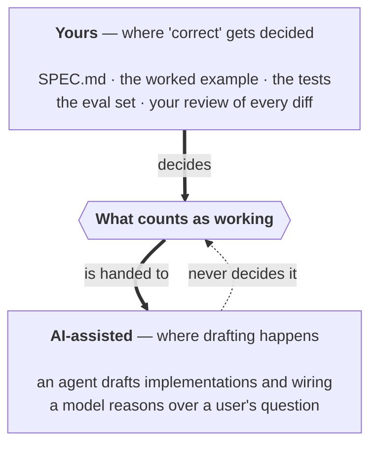
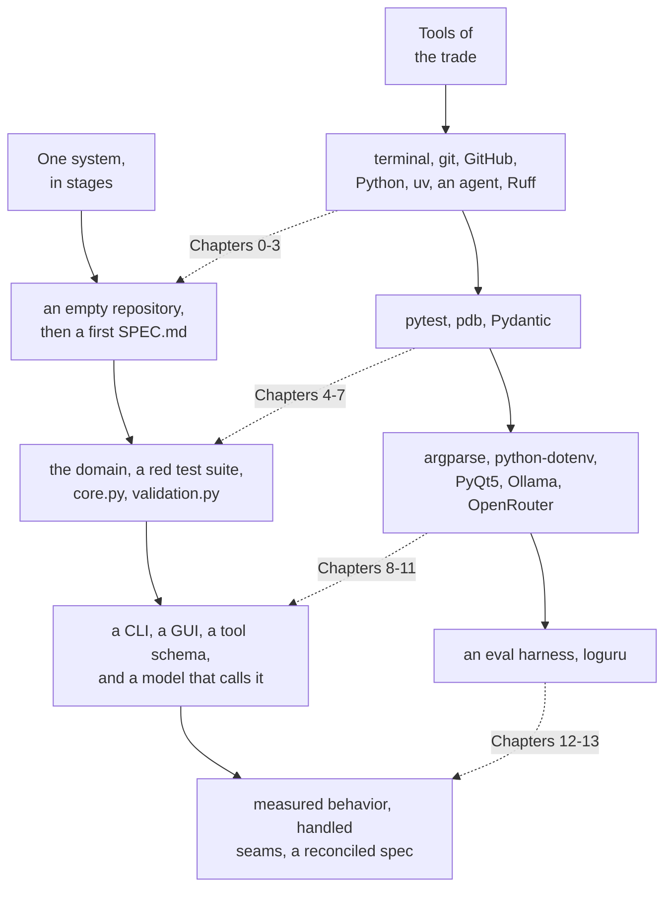

# Introduction to Software Engineering in the Age of AI

<!-- *A hands-on introduction, built one working system at a time* -->

```text


```

> *To my wife, Ellen,*
> *for her patience and support.*

```text

```

## Who This Book Is For

This book is written for first-year students and casual learners — people who are curious about software engineering and willing to sit down and build something real, but who don't yet have a professional engineering background to draw on.

Here's what we assume you *do* have: comfort using a computer (you can find a file, open a terminal, install something), and enough curiosity about numbers to follow a formula when it's explained rather than just handed to you. Here's what we assume you *don't* have: prior experience with Python, git, or any of the tools this book introduces. If you've never opened a terminal before, Chapter 0 starts there, on purpose.

We should also say plainly who this book is *not* for. If you're already a working software engineer looking for advanced patterns in agentic development — multi-agent orchestration, production-grade evaluation infrastructure, enterprise deployment — you'll outgrow this book quickly, and that's fine. This is a first book, not a deep one. We'd rather tell you that now than have you discover it forty pages in.

## What "Hybrid" Means in This Book

You'll see the word *hybrid* a lot in the chapters ahead, so it's worth defining before we use it for the first time.

A hybrid system, as this book means it, has two parts: a core that you design, write, and verify yourself — and an AI-assisted layer built around that core, where an agent drafts and a model reasons, but neither one gets to decide what "correct" means. That decision stays with you, and it gets written down, in three different forms, at three different points in the book: first as a plain-language spec, then as executable tests, then as a formal schema a language model can call. Same contract, three altitudes. You'll notice this pattern recur — we've flagged it with a callout box each time it shows up, because it's the actual idea this book is trying to teach, more than any individual tool.

The boundary that definition draws is the one thing worth carrying through every chapter that follows, so here it is as a picture before it's a practice:



<!-- DIAGRAM BUILD NOTE: render this mermaid block to an image (e.g. via mermaid-cli) for the print/PDF build -- most PDF pipelines won't render mermaid syntax directly. -->

The heavy arrows run downward on purpose. Everything in the top box is something you write, and together they settle what "working" means; the assisted layer at the bottom works *from* that settlement, constantly and usefully. The dotted arrow going back up is the one this book spends fourteen chapters teaching you not to draw.

This split — human-verified core, AI-assisted layer — isn't a compromise or a hedge. It's the whole point. A book that taught you to let an agent write everything would be teaching you to trust something you can't yet evaluate. A book that banned AI assistance entirely would be pretending the tools in Chapter 1 don't exist, or don't matter. This book tries to do something more useful than either: show you exactly where the boundary between "yours" and "assisted" belongs, and give you enough practice drawing that line yourself that you can keep drawing it correctly long after you've finished the last chapter.

## How This Book Is Structured

Two threads run through this book side by side, braided rather than stacked.

The first is **tools of the trade** — the terminal, git, Python, a coding agent, local and hosted language models, and everything in between. We introduce each tool right before the chapter that needs it, not all at once up front. You won't get a 300-page tools reference before you're allowed to write a line of code.

The second is **one system, built in stages**: a hybrid mortgage calculator, extended chapter by chapter from an empty repository to a working application with three different front ends — a command line, a graphical interface, and a language model that can operate it on your behalf. Every chapter leaves that system a little more complete, and a little more trustworthy, than it found it.

Braided, the two threads look like this — each group of tools arriving just before the stage of the system that needs it:



<!-- DIAGRAM BUILD NOTE: render this mermaid block to an image (e.g. via mermaid-cli) for the print/PDF build -- most PDF pipelines won't render mermaid syntax directly. -->

The dotted arrows are the braid: no tool appears in the top row until the bottom row has a use for it. That's why Pydantic shows up in the same group as validation rather than in a setup chapter, and why loguru waits until there are seams worth logging.


Most build chapters follow the same shape: a goal, the design decisions behind it, a test-driven development cycle, an implementation (often agent-assisted), an honest look at what the agent's role actually was, and a checkpoint — a clear statement of what should be true about your system right now. We're naming that shape once, here, so that by Chapter 3 it feels familiar instead of repetitive. Alongside it, you'll see two recurring devices: a **definition of done** checklist that grows a line or two with each chapter, and **process concept** callout boxes marking ideas — like TDD, or "the spec was wrong, not the code" — that matter well beyond the chapter they first appear in.

## How to Use This Book

This book is meant to be built along with, not just read. You'll get more out of every chapter by actually typing the commands, running the tests, and reading the diffs an agent proposes than by reading a description of someone else doing it. That said, if you want to read it straight through first to get the shape of the thing before building anything, that works too — just know that the "definition of done" checklists and worked examples are written for someone with a terminal open.

Before Chapter 0, you need one thing: a computer capable of running a local language model. We'll help you figure out whether yours qualifies in Chapter 1, with a plain hardware gut-check rather than a spec sheet you have to interpret yourself. If your setup turns out not to be enough, or gives you trouble, Chapter 1 also includes an escape hatch — a path to a hosted model that keeps you moving without derailing the rest of the book. You can come back to running things locally later, once the pressure's off.

A note on pacing: every chapter ends at a checkpoint, and every checkpoint describes exactly what should be true about your project at that point. If something's not working, that checkpoint is there so you can compare against a known-good state instead of debugging in isolation, wondering how far back the problem goes. Use it.

Finally, permission to skip things: the Appendix covers tools and practices — Docker, CI/CD, type checking, and a few others — that are genuinely useful but not required to finish this book. Skip it entirely on your first pass. It'll still be there when a future project actually needs it.

## A Note on What This Book Doesn't Cover

In the interest of finishing a book you'll actually complete, we left some real, valuable things out on purpose: Docker, continuous integration, static type checking, pre-commit automation, and a few others. None of them are missing by accident, and none of them are things we think you shouldn't eventually learn — they're just overhead this particular project, at this particular level, doesn't need yet. Each one gets a short, honest description in the Appendix: what it does, what it would have added here, and where to go looking when you're ready for it.

That's the scope discipline this whole book tries to model, starting now, before Chapter 0 even begins: know what you're building, know what you're deliberately leaving out, and write both of those things down.

— *Robert Ioffe*

  Portland, Oregon

  September 1, 2026
