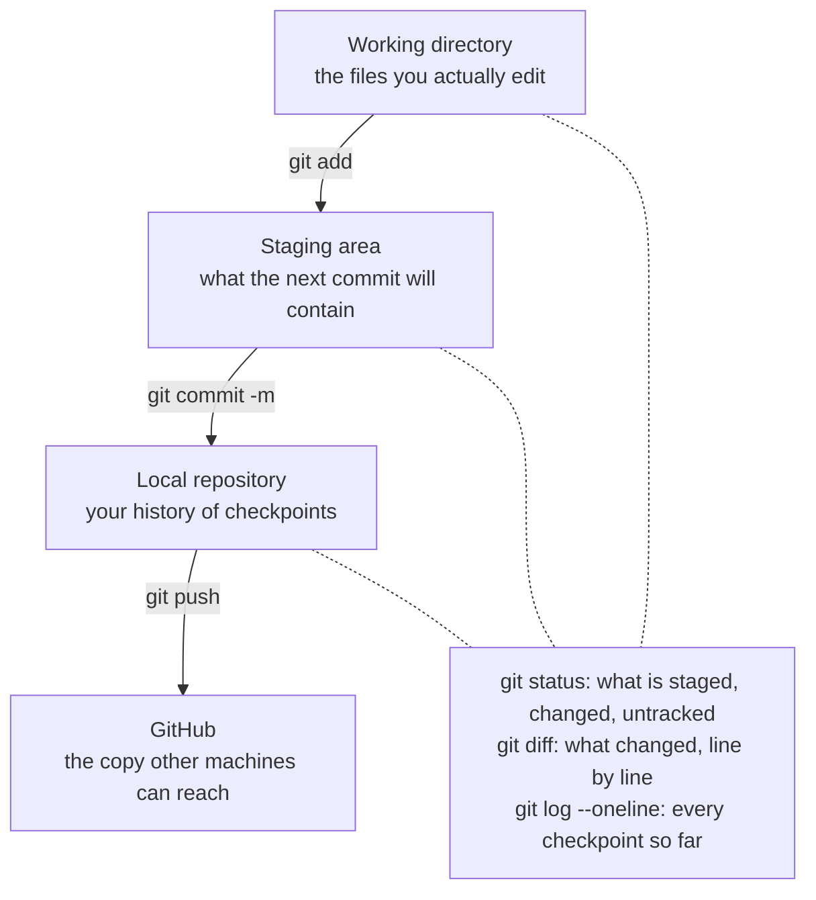

# Chapter 0 — Orientation

## 0.1 Why This Chapter Exists

Every chapter after this one assumes you have a few things already in place: a terminal you're not afraid of, a git repository that's tracking your work, and a Python project set up the way the rest of this book expects. This chapter builds all of that. Nothing here is specific to mortgages, AI, or agents — it's the ground floor everything else stands on.

By the end of this chapter, you'll have an empty-but-real project: initialized, version-controlled, pushed to GitHub, and ready to hand to a coding agent in Chapter 1.

## 0.2 The Terminal

### 0.2.1 Opening a Terminal

- **macOS**: open Spotlight (Cmd+Space), type `Terminal`, press Enter.
- **Linux**: almost every distribution ships a terminal app in its applications menu; on many, Ctrl+Alt+T opens one directly.
- **Windows**: install [Windows Terminal](https://apps.microsoft.com/detail/9n0dx20hk701) from the Microsoft Store, and use it to run WSL (Windows Subsystem for Linux) rather than the classic Command Prompt. This book assumes a Unix-like shell throughout; WSL gives you one without leaving Windows.

Whichever you use, you should end up looking at a mostly-empty window with a blinking cursor next to a **prompt** — something like `robert@machine ~ %`. That prompt is waiting for you to type a command.

### 0.2.2 Navigation

Three commands get you almost everywhere:

```bash
pwd           # print working directory — "where am I?"
ls            # list what's in the current directory
cd Documents  # change directory — "go here"
```

A few navigation shortcuts worth knowing immediately:

```bash
cd ..      # go up one level
cd ~       # go to your home directory
cd -       # go back to wherever you just were
```

Paths can be **relative** (`cd Documents`, starting from where you are) or **absolute** (`cd /Users/robert/Documents`, starting from the very top). When in doubt, `pwd` tells you where "where you are" actually is.

### 0.2.3 File Basics

```bash
mkdir mortgage-calculator-book  # make a new directory
touch notes.txt                 # create an empty file
cat notes.txt                   # print a file's contents
rm notes.txt                    # delete a file
```

That last one deserves its own line: **`rm` does not ask twice, and it does not go to a recycle bin.** Get in the habit of double-checking what you're about to delete, especially once wildcards enter the picture (`rm *.txt` deletes *every* `.txt` file in the current directory, no confirmation).

### 0.2.4 Why the Terminal Matters More Now, Not Less

It might seem like an AI-assisted book would need the terminal less than an older one — surely the agent handles the typing? In practice, the opposite is true. Pi, the coding agent you'll meet in Chapter 1, does its work *in* a terminal: reading files, running commands, executing tests. Understanding the terminal isn't a prerequisite you'll outgrow once the agent shows up — it's how you'll read what the agent is actually doing, and how you'll independently verify it.

## 0.3 Git Basics

### 0.3.1 What Version Control Is Actually For

Git is often introduced as "backup," which undersells it. What git actually gives you is a series of **checkpoints** — snapshots of your project at moments you chose, each one recoverable, each one comparable to any other. That matters for any project, but it matters especially once an agent is also editing your files: git is how you know exactly what changed, when, and whether you want to keep it.

### 0.3.2 Installing and Configuring Git

Check whether you already have it:

```bash
git --version
```

If that fails, install it via your system's package manager (`brew install git` on macOS, `sudo apt install git` on Debian/Ubuntu-based Linux, or the WSL equivalent). Then tell git who you are — it stamps this on every commit you make:

```bash
git config --global user.name "Your Name"
git config --global user.email "you@example.com"
```

Remember these two values — they resurface sooner than you'd expect. Section 0.7.2 will show you exactly where.

### 0.3.3 The Core Loop

```bash
cd mortgage-calculator-book
git init                        # start tracking this directory
git status                      # what's changed since the last commit?
git add SPEC.md                 # stage a specific file
git add .                       # stage everything that's changed
git commit -m "Initial commit"  # save a checkpoint, with a message
```

Those commands move your work between three distinct places, and keeping the three straight is most of what makes git click:



<!-- DIAGRAM BUILD NOTE: render this mermaid block to an image (e.g. via mermaid-cli) for the print/PDF build -- most PDF pipelines won't render mermaid syntax directly. -->

The solid arrows move things forward; the dotted ones only look. Nothing skips a step: a file you edited isn't in a commit until it has been through staging, which is exactly why `git add` and `git commit` are two commands rather than one.

`git status` is the command you'll run constantly — more than any other in this book. It tells you what's staged, what's changed but unstaged, and what git doesn't know about yet. Run it often; there's no penalty for checking.

### 0.3.4 Reading a Commit Log

```bash
git log --oneline
```

This gives you a compact history of every checkpoint you've made — one line per commit, most recent first. As this project grows across the rest of the book, this is how you'll orient yourself: "what did I actually do in Chapter 4?"

> **Process concept: commits as checkpoints.** A commit is cheap, fast, and reversible in a way that makes it worth doing far more often than feels necessary at first. Get in the habit now, before Chapter 1 hands your repository to an agent: commit before you let anything — agent or otherwise — make a change you haven't reviewed yet. If something goes wrong, you want a recent checkpoint to fall back to, not a blank slate.

## 0.4 GitHub.com

### 0.4.1 Creating an Account

Sign up at [github.com](https://github.com) if you haven't already. You don't need to create a repository through the website yet — section 0.4.4 below sets one up directly from the terminal, which turns out to be less work once you have one more tool installed.

### 0.4.2 Installing and Authenticating gh

`gh` is GitHub's own command-line tool — it lets you create repositories, open pull requests, and authenticate, all without leaving the terminal. Install it following the instructions at [cli.github.com](https://cli.github.com) (on macOS: `brew install gh`), then confirm:

```bash
gh --version
```

Now authenticate:

```bash
gh auth login
```

This starts an interactive flow: choose `GitHub.com`, then choose your preferred protocol — **SSH** is this book's recommendation, for the reason section 0.4.3 explains — then let it open a browser to confirm the login. If you chose SSH, `gh` will offer to generate a new SSH key and upload it to your account for you automatically. Say yes; that's the easiest path, and it means section 0.4.3 below is mostly just explaining what just happened rather than more work for you to do.

<!-- SCREENSHOT: the gh auth login interactive prompt mid-flow, showing the SSH-vs-HTTPS protocol choice -->
<!-- SCREENSHOT: the browser confirmation screen gh auth login opens (the "device successfully connected" page) -->

### 0.4.3 SSH Keys, Briefly

Every push to GitHub needs to prove it's really you. SSH keys are how: a matched pair of cryptographic keys, one **private** (stays on your machine, never shared), one **public** (uploaded to GitHub). GitHub can use the public key to confirm that whoever's pushing holds the matching private key, without you typing a password or token on every push.

If you let `gh auth login` generate a key for you in 0.4.2, this is already done — skip to the verification command below. If you'd rather set it up by hand, or want to see what `gh` did automatically, here's the manual version:

```bash
ssh-keygen -t ed25519 -C "you@example.com"  # accept the defaults
eval "$(ssh-agent -s)"
ssh-add ~/.ssh/id_ed25519
cat ~/.ssh/id_ed25519.pub                   # copy this output
```

Then, in a browser: GitHub → Settings → SSH and GPG keys → New SSH key, and paste what you copied.

<!-- SCREENSHOT: GitHub's SSH keys settings page (Settings -> SSH and GPG keys) with a key listed -- blur/redact the actual key fingerprint -->

Either way — automatic or manual — verify it worked:

```bash
ssh -T git@github.com
```

You're looking for `Hi <your-username>! You've successfully authenticated, but GitHub does not provide shell access.` That message, not an error, means you're set up correctly.

<!-- SCREENSHOT: terminal output of `ssh -T git@github.com` showing the "successfully authenticated" line -->

### 0.4.4 Creating and Connecting the Repository

With `gh` authenticated, creating a repository and connecting your local project to it is one command, run from inside `mortgage-calculator-book`:

```bash
gh repo create mortgage-calculator-book --public --source . --remote origin
```

This creates the repository on GitHub, and wires up your local repository's `origin` remote to point at it — both steps 0.4.4 and part of what used to be a separate "connect local to remote" step, done together.

<!-- SCREENSHOT: terminal output of `gh repo create ... --source . --remote origin` showing the confirmation URL it prints -->

If you'd rather create the repository through the browser instead: go to [github.com/new](https://github.com/new), name it `mortgage-calculator-book`, and leave it empty — no README, no `.gitignore` (0.7.3 creates that one properly, before it's actually needed). Then connect it by hand:

```bash
git remote add origin \
    git@github.com:YOUR_USERNAME/mortgage-calculator-book.git
```

Either path, finish by making sure your branch is named `main` and pushing:

```bash
git branch -M main            # only needed if not already on main
git push -u origin main
```

After this, `git push` alone (no flags) will work for future commits.

### 0.4.5 Reading a Diff

Before going further, one concept worth naming properly, because you'll rely on it constantly starting in Chapter 1: a **diff** — short for "difference" — is a line-by-line comparison between two versions of a file. Run `git diff` after changing a tracked file, and git shows you exactly what changed: lines removed, lines added, and a little unchanged context around them so you can see where the change sits.

For example, editing a line in `README.md` might produce:

```diff
 # Mortgage Calculator
-A calculator.
+Calculates the fixed periodic payment for a fixed-rate mortgage.
```

The unprefixed line is unchanged context. The `-` line is what the file used to say. The `+` line is what replaced it. That's the entire vocabulary: minus means removed, plus means added, no prefix means unchanged.

This is arguably the single most load-bearing skill in this whole book. Starting in Chapter 1, every time Pi proposes a change, you'll be reading a diff like this one to see exactly what it's proposing before you accept it.

## 0.5 vi, Just Enough

### 0.5.1 Why Bother

You will, at some point in this book — or in real engineering work afterward — end up needing to edit a file with no graphical editor available. The most common version of this: connecting to a remote machine over SSH (the same secure-connection technology from 0.4.3, just used here to log into a server rather than to authenticate with GitHub) and finding yourself with only a terminal — no windows, no mouse, no familiar text editor installed, just whatever's already on that machine. vi (or its more common modern form, vim) is installed almost everywhere by default, which is exactly why twenty minutes now saves you from being stuck later.

### 0.5.2 Modes

vi's defining quirk is that it has **modes** — the same keys do different things depending on which mode you're in.

- **Normal mode** (where you start): keys are commands, not text.
- **Insert mode**: keys are text, typed normally.
- **Command mode**: for saving, quitting, and search-and-replace.

### 0.5.3 The Commands You Actually Need

```
i        enter insert mode (start typing)
Esc      leave insert mode, back to normal
:w       write (save)
:q       quit
:wq      write and quit
dd       delete the current line
/word    search for "word"
```

That's genuinely enough to survive. Open a scratch file and practice: `vi scratch.txt`, press `i`, type a sentence, press `Esc`, then `:wq`. Confirm it actually saved:

```bash
cat scratch.txt
```

You should see the sentence you typed printed back to you.

### 0.5.4 When to Reach for It

vi is not this book's daily driver — most of your editing will happen in whatever full editor you're comfortable with, or through the agent itself. Treat vi as a tool for the specific situation where nothing else is available, not as something you need to master.

## 0.6 Python 3.12

### 0.6.1 Installing

Download Python 3.12 from [python.org](https://www.python.org/downloads/) or install it via your package manager. This book uses 3.12 specifically — later chapters rely on language features and standard-library behavior introduced by that version, so an older Python may produce confusing, version-specific errors that have nothing to do with your code.

### 0.6.2 Checking Your Install

```bash
python3 --version
```

You're looking for `Python 3.12.x`. If you have multiple versions installed and the wrong one shows up, `uv` (0.7 below) will help you pin the right one per-project, so don't spend too long fighting your system's default.

### 0.6.3 What's Relevant Here

If you've seen Python tutorials from a few years ago, one thing is worth explaining properly before it shows up throughout this book: **type hints**. A type hint is an optional annotation on a function's parameters and return value, stating what kind of data is expected:

```python
def greet(name: str) -> str:
    return f"Hello, {name}"
```

Here, `name: str` says the `name` parameter should be a string, and `-> str` says the function returns a string. Python doesn't strictly enforce these at runtime by default — they're documentation, for you and for Pi starting in Chapter 1, more than an ironclad guarantee — but they make code substantially easier to both read and generate correctly, which is why this book uses them in every function from Chapter 6 onward. Error messages are also noticeably more specific about *where* and *why* something went wrong than in older Python versions. Both matter for this book — you'll be reading type hints throughout, and reading error messages closely is a skill this book leans on more than most.

## 0.7 uv & Good Project Structure

### 0.7.1 What uv Is

`uv` is a fast, modern tool for managing Python projects — dependencies, virtual environments, and the Python version itself, all through one tool instead of the traditional pip-plus-venv-plus-something-else combination. This book uses `uv` throughout because it removes a category of setup friction that has nothing to do with learning software engineering.

Install it following the instructions at [docs.astral.sh/uv](https://docs.astral.sh/uv/), or via your system's package manager — on macOS, `brew install uv` works just as well. Either path works fine for this book; use whichever you're more comfortable keeping updated. Then confirm:

```bash
uv --version
```

### 0.7.2 Initializing the Project

```bash
uv init --package
```

The `--package` flag matters: bare `uv init` sets up a single-file `main.py` sitting at the project root, not the installable `src/` layout this book uses throughout. `--package` is what actually generates that layout, along with a `[project.scripts]` entry point — both covered in 0.7.3 just below.

This generates a `pyproject.toml` — the file that describes your project: its name, its dependencies, and how it's built. Here's what it actually contains right after running `uv init --package` (this example is from the author's own machine — yours will show your own name and email, not this one):

```toml
[project]
name = "mortgage-calculator-book"
version = "0.1.0"
description = "Add your description here"
readme = "README.md"
authors = [
    { name = "Robert Ioffe", email = "robert.ioffe@vinipuh.com" }
]
requires-python = ">=3.12"
dependencies = []

[project.scripts]
mortgage-calculator-book = "mortgage_calculator_book:main"

[build-system]
requires = ["uv_build>=0.12.5,<0.13.0"]
build-backend = "uv_build"
```

A few things worth noticing. The `authors` field wasn't typed by hand — `uv init --package` pulled it straight from the same `git config --global user.name` and `user.email` you set back in 0.3.2, which is why it was worth getting those right early. `dependencies = []` is empty for now; it starts filling up in Chapter 5. And `[project.scripts]` already contains an entry pointing at a `main` function that doesn't exist yet anywhere in your project — `uv init --package` generates this automatically as a placeholder for a command-line entry point; Chapter 8 replaces it with the CLI's real one, so don't worry about it being unfulfilled until then.

You'll also see a `.python-version` file appear alongside `pyproject.toml` — that's `uv` pinning the exact Python version for this project, the same reproducibility idea as `uv.lock` in 0.7.4 below, just for the interpreter rather than the dependencies. It's meant to be committed, not ignored.

You'll come back to `pyproject.toml` constantly; every `uv add` command in later chapters edits it for you.

### 0.7.3 Project Layout

This book uses a **src layout**: your actual package lives inside a `src/` directory, rather than sitting directly in the project root.

```
mortgage-calculator-book/
|-- .gitignore
|-- pyproject.toml
|-- uv.lock
|-- README.md
|-- SPEC.md
|-- src/
|   `-- mortgage_calculator_book/
|       `-- __init__.py
`-- tests/
```

The reason: a src layout forces your code to be *installed* to be imported, the same way it would be for anyone else using it — which catches a whole class of "works on my machine because I happened to be in the right directory" bugs before they happen. It's a small amount of extra structure up front that pays for itself the moment you write your first test in Chapter 5.

One more file belongs in this skeleton before the first commit: `.gitignore`. 0.4.4 deliberately left it out when the GitHub repository was created — this is where it actually gets built, and it needs to exist *before* anything below generates the files it's meant to exclude, not after:

```bash
vi .gitignore
```

```
# Byte-compiled / cached Python files
__pycache__/
*.pyc
*.pyo

# Test and linter caches
.pytest_cache/
.ruff_cache/

# Virtual environments
.venv/
```

Every one of these gets created automatically as this project grows — `.venv/` by `uv` itself, starting with `uv add` in 0.7.4 just below; `__pycache__/` the first time any Python file actually runs; `.pytest_cache/` and `.ruff_cache/` once pytest and Ruff exist, in Chapters 5 and 3. None of them belong in git: they're regenerable, often large, and specific to your machine, not your project. Skip this file now, and a plain `git add .` in any later chapter will happily stage all of it.

To check your own layout matches this at a glance, rather than reading through nested `ls` output by hand, either of these works:

```bash
tree -I '.git'        # brew install tree on macOS if you don't have it
ls -R                 # no install needed, less readable for deep trees
```

Once it matches, commit and push it — this is a real checkpoint, worth its own commit message:

```bash
git add .
git commit -m "Set up project skeleton"
git push
```

Then open your repository on github.com in a browser and confirm the files are actually there. This is worth doing deliberately, not just trusting the terminal: a push can succeed locally against the wrong remote, or against a branch you didn't mean to push, and the only way to be sure is to look.

<!-- SCREENSHOT: the repository's file listing on github.com right after the first push -- the payoff shot for this verification step -->

### 0.7.4 Adding a Dependency

```bash
uv add requests
```

This updates `pyproject.toml` and creates (or updates) `uv.lock` — a file that pins the *exact* version of every dependency, direct and indirect, so that "it works on my machine" means the same thing on any machine that runs `uv sync`. You won't need any dependencies yet in this chapter; you'll see this command for real starting in Chapter 5.

### 0.7.5 The Skeleton You're Building Toward

By the end of this chapter, your project should match the layout above, minus anything you haven't built yet — just `.gitignore`, `pyproject.toml`, `uv.lock`, an empty `README.md` and `SPEC.md`, and an empty `mortgage_calculator_book` package. Every later chapter adds to this same skeleton; nothing gets rebuilt from scratch.

Confirm it works:

```bash
uv run python -c "import mortgage_calculator_book; print('ok')"
```

If that prints `ok`, your project is wired together correctly.

## 0.8 Checkpoint

Before moving to Chapter 1, this should all be true:

- [ ] You can open a terminal and navigate with `pwd`, `ls`, `cd`
- [ ] Git is installed and configured with your name and email
- [ ] `mortgage-calculator-book` is a git repository with at least one commit
- [ ] `gh` is installed and authenticated (`gh auth login` completed successfully)
- [ ] `ssh -T git@github.com` prints the "successfully authenticated" message
- [ ] You can explain, in your own words, what a diff shows and why the `+`/`-` prefixes matter
- [ ] You can open, edit, and save a file in vi without help, and verify the save with `cat`
- [ ] `uv run python --version` reports 3.12.x
- [ ] `uv run python -c "import mortgage_calculator_book; print('ok')"` prints `ok`
- [ ] `.gitignore` exists and excludes `__pycache__/`, `.pytest_cache/`, `.ruff_cache/`, and `.venv/`
- [ ] Your project has been committed and pushed, and you've confirmed the files are visible on github.com in a browser — not just assumed from a successful-looking terminal command

**What's next:** Chapter 1 hands this repository to a coding agent for the first time — installing Pi, connecting it to a local model, and making your first small, reviewed, agent-assisted change.
