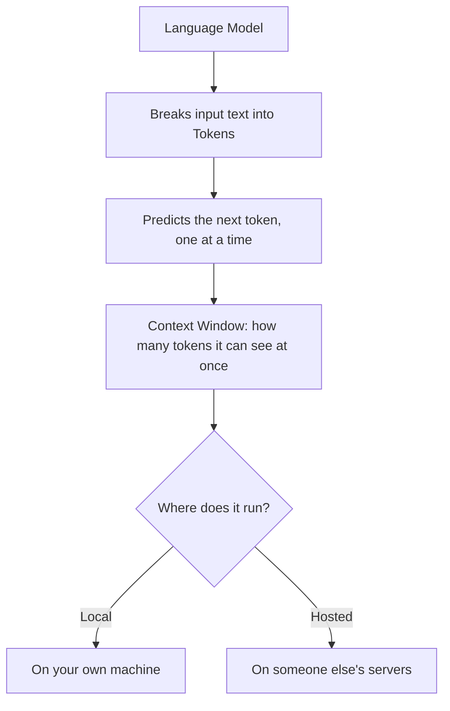
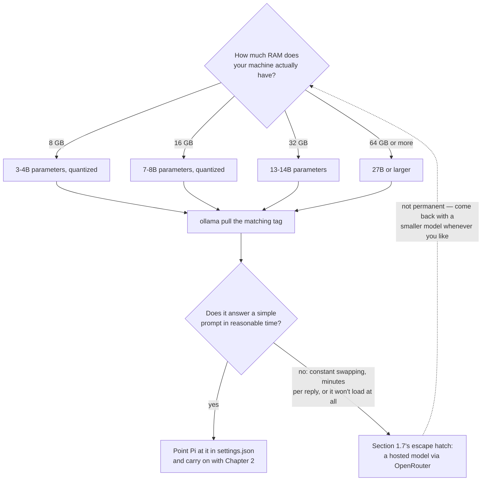
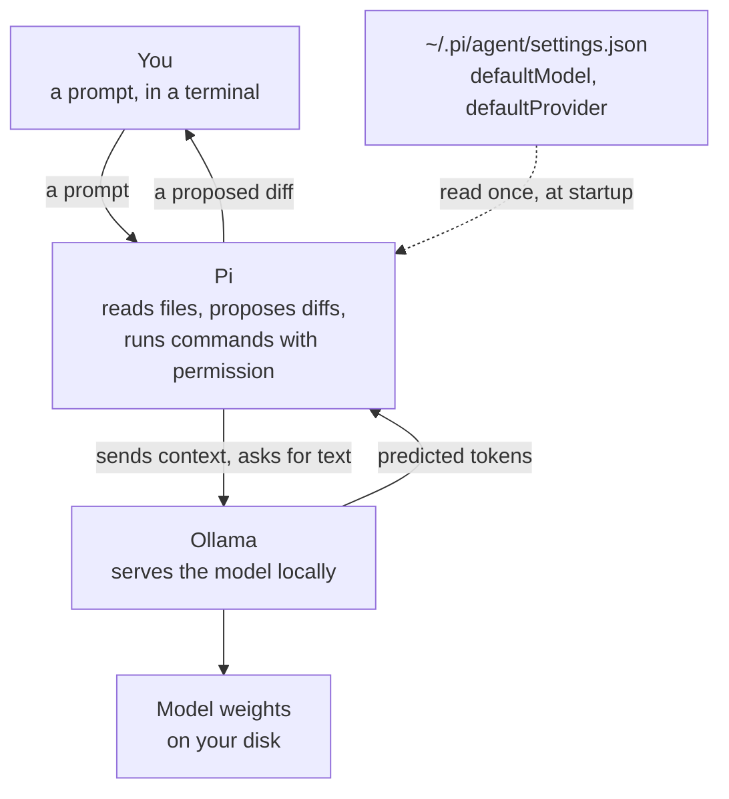
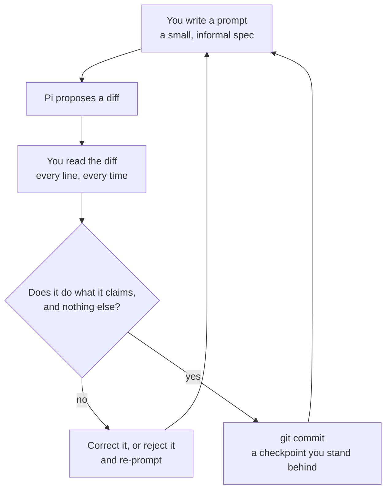

# Chapter 1 — Meet Your Coding Agent

## 1.1 Why This Chapter Exists

Chapter 0 gave you an empty, properly structured project. This chapter gives that project a collaborator. By the end, you'll have a local language model running on your own machine, a coding agent called Pi configured to use it, and — most importantly — a first small, deliberately reviewed interaction with that agent, on the record in your git history.

Nothing gets built for the mortgage calculator in this chapter. That starts in Chapter 4. This chapter is entirely about setting up the working relationship you'll rely on for the rest of the book.

## 1.2 What a Model Actually Is

A language model, at a basic level, is a program trained on enormous amounts of text that has learned to predict what text comes next, given what came before. That's the whole definition this book needs. Everything below just unpacks what that prediction process implies in practice — and the diagram gives you the shape of it before the prose does:



<!-- DIAGRAM BUILD NOTE: render this mermaid block to an image (e.g. via mermaid-cli) for the print/PDF build -- most PDF pipelines won't render mermaid syntax directly. -->

### 1.2.1 Tokens

A language model doesn't read text the way you do. It breaks text into **tokens** — small chunks, sometimes whole words, sometimes fragments of words — and predicts, one token at a time, what's likely to come next. That's the entire mechanism underneath everything Pi does: read some tokens, predict the next ones, repeat. It's worth holding onto this plain description, because it's easy to start attributing more to a model than that description supports, and this book would rather you keep a clear, ungenerous picture of what's actually happening.

### 1.2.2 Context Windows

A model can only "see" a limited number of tokens at once — its **context window**. Everything outside that window, the model simply doesn't have access to. This matters more than raw model size for almost everything you'll do in this book: a smaller model that can see your whole file is often more useful than a larger one that can only see half of it. You'll feel the practical effects of this directly once Pi starts working across multiple files in later chapters.

### 1.2.3 Local vs. Hosted

A **local** model runs entirely on your own machine — private, free to run repeatedly, but limited by your hardware. A **hosted** model runs on someone else's infrastructure, reachable over the internet — typically more capable, but costing money per use and requiring a network connection. This book uses both: a local model for Pi in this chapter, and later, in Chapter 11, a choice between a second local model and a hosted one for the calculator's own intelligence engine — two different jobs, and the right answer isn't the same for both.

> **Process concept: demystifying the agent, early.** It's worth being blunt about this now, before Pi has done anything impressive: the agent you're about to install is a tool with real limits, not an oracle. Everything in this book's approach — reviewing diffs, writing tests first, keeping a human-authored spec — assumes you'll treat it that way throughout. Chapter 1 is a strange place to plant that idea, before you've even seen the tool work, but it's easier to keep a level head about a tool before it impresses you than after.

## 1.3 Ollama

### 1.3.1 Installing

[Ollama](https://ollama.com) is a tool for running language models locally with minimal setup. Download and install it for your platform, then confirm:

```bash
ollama --version
```

### 1.3.2 Pulling a Model

```bash
ollama pull qwen3:8b
```

This downloads the model's weights to your machine — a multi-gigabyte file, so this step takes a few minutes depending on your connection. (We'll pick the specific model for Pi's job in section 1.4; `qwen3:8b` here is just to confirm Ollama itself works.)

### 1.3.3 A First Raw Conversation

Before wiring anything to Pi, talk to the model directly:

```bash
ollama run qwen3:8b
```

This drops you into an interactive prompt. Ask it something simple — "what is a checksum?" — and read the response. This isn't testing Pi yet; it's building a baseline sense of what the underlying model sounds like, on its own, with no agent framework around it. Type `/bye` to exit.

### 1.3.4 Where the Model Lives

Model weights are stored under Ollama's own data directory (`~/.ollama` on macOS and Linux by default). If you're working with limited disk space, `ollama list` shows what you've pulled, and `ollama rm <model>` removes one. Worth knowing before you've pulled three 8-gigabyte models you don't need anymore.

## 1.4 Choosing a Local Model for the Coding Agent

### 1.4.1 Why the Choice Matters Here Specifically

Not every model is good at the same things. A model tuned for open-ended conversation isn't necessarily good at reading a diff, following an instruction precisely, or staying inside the bounds of a file it was asked to edit. The job in this chapter is narrow — coding agent support — and it's worth picking a model suited to that job rather than whatever's most popular in general.

### 1.4.2 This Book's Working Example: Qwen3

This book uses a Qwen3 variant as its running example for Pi's model, sized to run well on typical development hardware while still handling code-focused tasks competently:

```bash
ollama pull qwen3.8:27b
```

**On macOS specifically**, pull the MLX-optimized variant instead — built for Apple Silicon rather than a generic cross-platform target:

```bash
ollama pull qwen3.8:27b-mlx
```

At roughly 18GB, it's a smaller download than the generic build, and runs noticeably better on Apple Silicon's unified memory architecture. Either variant gives Pi meaningfully better judgment on multi-file changes than the smaller 8B model from 1.3.2, if your hardware supports it. If not, 1.4.3 below will help you decide where to land.

### 1.4.3 A Hardware Gut-Check

As a rough guide — not a precise spec, just enough to self-select before installing something too large:

| Available RAM | Reasonable model size |
|---|---|
| 8 GB | 3–4B parameters, quantized |
| 16 GB | 7–8B parameters, quantized |
| 32 GB | 13–14B parameters |
| 64 GB+ | 27B+ parameters |

**Quantization** — reducing the precision of a model's internal numbers — trades a small amount of accuracy for a large reduction in memory and disk use, which is why quantized model sizes appear throughout this table rather than the full-precision numbers you might see quoted elsewhere. Ollama pulls a reasonable default quantization automatically; you don't need to choose one by hand for this book.

If your hardware doesn't comfortably fit even the smallest row here, section 1.7's escape hatch is exactly for you — don't force a model that's too large for your machine just to stay "local" on principle.

The whole decision, including the escape hatch, as one path:



<!-- DIAGRAM BUILD NOTE: render this mermaid block to an image (e.g. via mermaid-cli) for the print/PDF build -- most PDF pipelines won't render mermaid syntax directly. -->

Notice that the escape hatch loops back rather than terminating. Taking it isn't a failure state or a one-way door; it's a way to keep moving today, with the local path still open tomorrow.


## 1.5 Installing and Configuring Pi

### 1.5.1 What Pi Actually Does

Pi is a coding agent: a program that can read your project's files, propose changes, and — with your permission at each step — run commands and write to disk. The model from section 1.4 is Pi's reasoning engine; Pi itself is the framework that lets that reasoning act on a real codebase instead of just producing text in a chat window.

Four separate pieces are involved, and it's worth seeing which one does what before you install any of them:



<!-- DIAGRAM BUILD NOTE: render this mermaid block to an image (e.g. via mermaid-cli) for the print/PDF build -- most PDF pipelines won't render mermaid syntax directly. -->

Only the rightmost box does any predicting. Everything Pi adds — finding the right files, assembling context, applying an edit, running a command — sits between you and that prediction, which is why section 1.4's choice of model and this section's choice of agent are genuinely separate decisions.

### 1.5.2 Installation

Follow the install instructions for your platform from Pi's documentation. Confirm it's available:

```bash
pi --version
```

### 1.5.3 Pointing Pi at Your Local Model

Pi doesn't have a `pi config set` command for this — model selection lives directly in Pi's settings file, `~/.pi/agent/settings.json`. This is a good first real use for the vi skills from 0.5: open the file and edit the values by hand.

```bash
vi ~/.pi/agent/settings.json
```

The fields that matter here are `defaultModel`, `defaultProvider`, and `defaultThinkingLevel`:

```json
{
  "defaultModel": "qwen3.8:27b-mlx",
  "defaultProvider": "ollama",
  "defaultThinkingLevel": "medium"
}
```

Set `defaultModel` to whichever tag you pulled in 1.4.2, and `defaultProvider` to `ollama`. `defaultThinkingLevel` controls how much the model reasons before answering — `medium` is a reasonable default to start with. (Pi's settings file has a few more fields too — including a `packages` list for installed extensions — that you can safely ignore for now; this book doesn't need any of them.)

### 1.5.4 Skills

Pi supports **skills** — packaged instructions that give it additional domain-specific guidance beyond its defaults. There's no `pi skills` command; skills are viewable and toggled through the same interactive screen `pi config` opens (Tab switches between scopes). Adding one is a matter of copying files rather than installing a package: a **global** skill goes in `~/.pi/agent/skills/`, available to every project; a **local** skill goes in `.pi/agent/skills/` inside a specific project, available only there. You don't need any skills for this book's core path — we'll flag it explicitly in later chapters if a particular skill would help with that chapter's task.

### 1.5.5 Starting Pi in the Repository

There's no separate `pi init` step. Pi's available commands, for reference:

```
pi install <source> [-l]     Install extension source and add to settings
pi remove <source> [-l]      Remove extension source from settings
pi uninstall <source> [-l]   Alias for remove
pi update [source|self|pi]   Update pi, extensions, or model catalogs
pi list                      List installed extensions from settings
pi config [-l]               Open TUI to enable/disable package resources
pi auth <command>            Print credentials or check provider readiness
```

Pointing Pi at your project is just a matter of being in it when you start it:

```bash
cd mortgage-calculator-book
pi
```

Running `pi` with no arguments starts an interactive session using the current directory as its project context — nothing more to configure.

## 1.6 Your First Agent-Assisted Interaction

### 1.6.1 A Deliberately Small Task

Every agent-assisted change in this book — from this docstring through Chapter 13's error handling — runs the same short loop:



<!-- DIAGRAM BUILD NOTE: render this mermaid block to an image (e.g. via mermaid-cli) for the print/PDF build -- most PDF pipelines won't render mermaid syntax directly. -->

The loop never gets a step removed as the book goes on — the diffs just get bigger. When a later chapter says "review this the same way you reviewed Chapter 1.6's," this is the shape it means.

Before trusting Pi with anything that matters, give it something safe and easy to check:

```bash
pi "Add a one-line docstring to the top of \
    src/mortgage_calculator_book/__init__.py describing \
    what this package is for."
```

This launches Pi in interactive mode with that instruction as your first message — Pi will think, propose a change, and then wait for you inside the session rather than exiting on its own. Once you've reviewed what it did (1.6.2 below), exit with **Ctrl+D**.

If you'd rather Pi run one instruction and exit immediately, without an interactive session, add `-p`:

```bash
pi -p "Add a one-line docstring to the top of \
       src/mortgage_calculator_book/__init__.py describing \
       what this package is for."
```

`-p` is short for "print": Pi runs the instruction, prints its response, and exits on its own — often more convenient for the small, self-contained tasks this book asks of it. The rest of this book shows Pi invocations in the plain form above; assume interactive mode and a Ctrl+D exit when you're done, unless a chapter says otherwise, and reach for `-p` yourself any time you'd rather skip the session entirely.

### 1.6.2 Reading the Diff

Pi will show you a proposed change before applying it. **Read it before accepting.** For a change this small, that takes seconds — but the habit is the point, not the specific diff. This book asks you to read every diff Pi proposes, all the way through Chapter 13, precisely because the changes get larger and the stakes get higher, and the habit needs to already be automatic by then.

```bash
git diff   # if the change was already applied, review it the normal git way
```

### 1.6.3 What "Trust but Verify" Looks Like Here

For this task, verifying is simple: does the docstring exist, does it say something true and reasonably clear about the package? For a one-line docstring, that's a five-second check. It won't stay that simple — Chapter 6's core library and Chapter 11's model wiring will ask considerably more of your review skills — but the underlying question is always the same one you're practicing right now: *does this change do what it claims to do, and nothing else?*

> **Process concept: prompting as spec-writing.** Notice that the instruction you gave Pi in 1.6.1 was really a tiny, informal spec — a statement of what should exist and roughly what it should say. Chapter 2 takes that same idea and gives it a proper name and a proper document: SPEC.md. Everything from here to Chapter 2 is really just this one interaction, done slightly larger.

Once you've reviewed the change and you're satisfied with it, commit it:

```bash
git add .
git commit -m "Add package docstring (Pi-assisted)"
```

## 1.7 Escape Hatch: If Local Setup Isn't Working

### 1.7.1 Recognizing the Signs

If Ollama is taking minutes to respond to a simple prompt, if your machine is swapping memory constantly, or if the model simply refuses to load — these are signs your hardware and your chosen model size aren't a good match, not signs you're doing something wrong.

### 1.7.2 A Minimal Fallback

You can point Pi at a hosted model instead, so you're not stuck before this book even really starts. The same settings file from 1.5.3 handles this too — there's no `pi config set` command here either:

```bash
vi ~/.pi/agent/settings.json
```

```json
{
  "defaultModel": "qwen/qwen3.8-27b",
  "defaultProvider": "openrouter"
}
```

This requires an OpenRouter account, an API key, and — since hosted calls cost real money per request — some actual credit sitting in the account; a fresh account with a zero balance will authenticate just fine and then fail the moment it tries to run anything. Chapter 11 covers this setup properly, including cost and usage tracking. For now, if you need this escape hatch: create an OpenRouter account, add a small amount of credit, generate a key, and set it as an environment variable:

```bash
export OPENROUTER_API_KEY="your-key-here"
```

### 1.7.3 This Isn't Permanent

Using a hosted model here doesn't lock you out of local models for the rest of the book — it just gets you moving today. Once you've read Chapter 1.4's hardware guidance more carefully, or found a smaller model that fits your machine, you can switch back at any point by editing `defaultModel` and `defaultProvider` in `~/.pi/agent/settings.json` again.

## 1.8 Checkpoint

Before moving to Chapter 2, this should all be true:

- [ ] Ollama is installed and a model has been pulled successfully
- [ ] You've had at least one raw conversation with the model via `ollama run`
- [ ] Pi is installed, and `~/.pi/agent/settings.json` points `defaultModel` and `defaultProvider` at either your local model or the Chapter 1.7 fallback
- [ ] Running `pi` from inside `mortgage-calculator-book` starts a session with that project as its context
- [ ] You've given Pi one small task, read its diff, exited cleanly (Ctrl+D or `-p`), and committed the result

**What's next:** Chapter 2 turns the informal instruction-giving you just practiced into something more deliberate — a written SPEC.md that describes what the calculator is actually supposed to do, before any real code exists.
