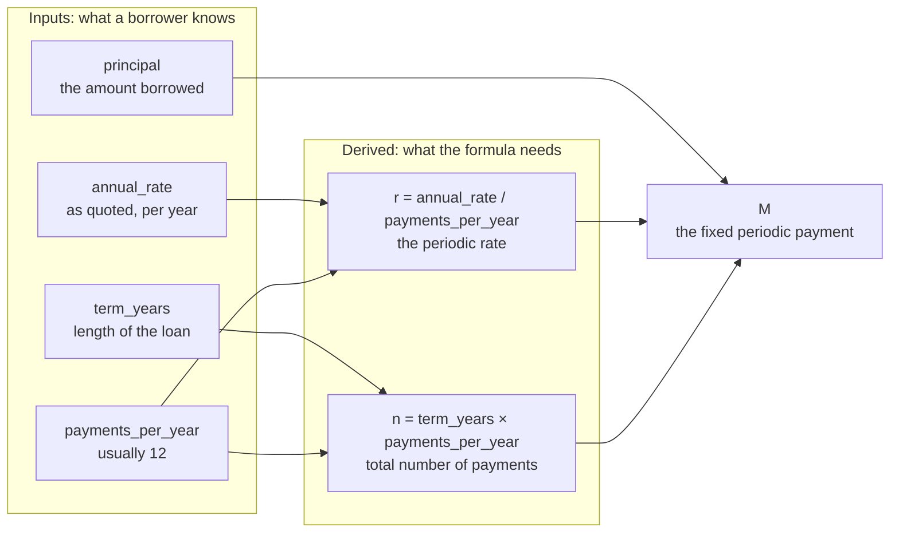
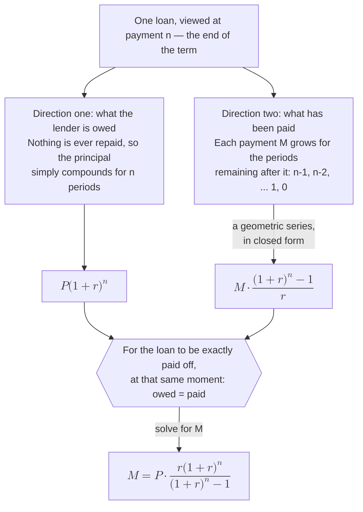

# Chapter 4 — The Domain: Fixed Mortgages

## 4.1 Why This Chapter Exists

No code gets written in this chapter. Instead, this chapter gives you the thing every later chapter's code will be checked against: a correct, hand-verified understanding of how a fixed-rate mortgage payment is actually calculated, and one specific worked example with exact numbers.

By the end, you'll have a revised `SPEC.md` — fixing the gaps Chapter 2 left open on purpose — and a worked example that Chapter 5's first test, Chapter 6's core library, and Chapter 12's evaluation set will all check themselves against.

## 4.2 Fixed Mortgage Primer

### 4.2.1 What a Mortgage Is

A mortgage is a loan used to buy property, where the property itself secures the loan — if payments stop, the lender can take the property back. Setting aside everything else about how mortgages work in practice, the part this book cares about is narrower and purely mathematical: given a loan amount, an interest rate, and a length of time to repay it, what should each periodic payment be?

### 4.2.2 Why "Fixed"

A **fixed-rate** mortgage has an interest rate that stays the same for the entire loan term, which means the payment amount stays the same too, from the first payment to the last. A **variable-rate** mortgage's rate can change over time, which means the payment can change too — a meaningfully different, more complex calculation this book deliberately leaves out of scope (as SPEC.md already says).

### 4.2.3 The Shape of a Payment

Here's the part that surprises a lot of first-time borrowers: even though the payment amount is fixed, what that payment is *made of* changes every period. Early payments are mostly interest, with a small amount going toward the actual principal. Late payments are the reverse — mostly principal, a small amount of interest. Why: interest is charged on whatever principal is still outstanding, and outstanding principal is highest at the start and lowest at the end. We won't build a full amortization schedule until it's needed, but understanding this shape now will make the formula in section 4.4 feel like it's describing something real, not just producing a number.

## 4.3 The Four Core Quantities

Every payment calculation in this book comes down to four numbers.

Two of them get used exactly as given; the other two get combined into a pair of derived quantities first, and it's that second pair the formula in 4.4 actually consumes:



<!-- DIAGRAM BUILD NOTE: render this mermaid block to an image (e.g. via mermaid-cli) for the print/PDF build -- most PDF pipelines won't render mermaid syntax directly. -->

Notice `payments_per_year` feeding both derived quantities. That single fact is why Chapter 2's spec was wrong in two places at once rather than one: leaving payment frequency unstated didn't just make the rate ambiguous, it made the payment count ambiguous too. This same shape shows up three more times in this book — as SPEC.md's "Derived quantities" section in 4.7.4, as three functions in `core.py` in Chapter 6, and as `MortgageInput`'s four fields in Chapter 7.

### 4.3.1 Principal

The amount actually borrowed. Everything else in the calculation exists to answer one question about this number: how do you pay it back, with interest, in equal installments?

### 4.3.2 Periodic Interest Rate

This is the number Chapter 2's draft spec quietly got wrong: "rate" is not the same as "periodic rate." Mortgage rates are quoted **annually** — a "6% mortgage" means 6% per year — but payments happen more often than once a year, almost always monthly. The rate that actually applies to each payment period is the annual rate divided by the number of periods per year:

$$r = \frac{\text{annual rate}}{\text{payments per year}}$$

For a 6% annual rate paid monthly: $r = 0.06 / 12 = 0.005$, or 0.5% per month. This conversion — annual to periodic — is the single most common place a first attempt at this calculation goes wrong, and it's exactly the gap Chapter 2's spec left open.

### 4.3.3 Total Number of Payments

Term length and payment frequency combine to give the total number of payments:

$$n = \text{term in years} \times \text{payments per year}$$

A 30-year loan paid monthly has $n = 30 \times 12 = 360$ payments. The same 30-year loan paid **biweekly** (every two weeks, 26 times a year) would have $n = 30 \times 26 = 780$ payments instead — a different total, and, as it turns out, a different total amount of interest paid over the life of the loan, purely from paying more frequently in smaller amounts. We'll come back to that as an aside once the main formula is in hand.

### 4.3.4 Fixed Periodic Payment

The quantity everything above exists to compute: the single, unchanging amount paid every period. This is what section 4.4 derives.

## 4.4 The Gory Details: Deriving the Formula

### 4.4.1 The Formula

$$M = P \cdot \frac{r(1+r)^n}{(1+r)^n - 1}$$

where $M$ is the fixed periodic payment, $P$ is the principal, $r$ is the periodic rate from 4.3.2, and $n$ is the total number of payments from 4.3.3. It looks dense on first read. The derivation below builds it up piece by piece, so it stops looking like something handed down from nowhere.

### 4.4.2 Where It Comes From

Think about the loan from two directions at once, both measured at the *end* of the loan — payment $n$.

**Direction one: what the lender is owed.** If nothing were ever paid, the principal would simply grow with interest every period, compounding: after $n$ periods, the lender would be owed $P(1+r)^n$.

**Direction two: what's been paid.** Each payment $M$, made at the end of its period, also "grows" from the moment it's paid until the end of the loan — because in effect, that payment could have been earning interest at rate $r$ for however many periods remain after it. The very last payment doesn't grow at all (it's already at the end). The second-to-last payment grows for one period. And so on, back to the first payment, which grows for $n-1$ periods. Summed up, the total grown value of every payment is:

$$M(1+r)^{n-1} + M(1+r)^{n-2} + \cdots + M(1+r)^1 + M(1+r)^0$$

This is a **geometric series** — the same kind of sum you may have seen in an algebra course, just with an interest rate standing in for the usual ratio. It has a well-known closed form:

$$M \cdot \frac{(1+r)^n - 1}{r}$$

**Setting the two directions equal.** For the loan to be exactly paid off at payment $n$ — no more, no less — what the lender is owed has to exactly equal what's been paid, both measured at that same end point:

$$P(1+r)^n = M \cdot \frac{(1+r)^n - 1}{r}$$

Solving for $M$ gives the formula from 4.4.1. Nothing about it is arbitrary — it's just "what's owed equals what's paid," stated at a single point in time to make the comparison fair, then rearranged.

The whole derivation, on one page:



<!-- DIAGRAM BUILD NOTE: render this mermaid block to an image (e.g. via mermaid-cli) for the print/PDF build -- most PDF pipelines won't render mermaid syntax directly. -->

The reason both branches have to be measured at the same moment is the part most worth holding onto. Money at payment 1 and money at payment 360 aren't comparable amounts; carrying both sides forward to the same end point is what makes setting them equal a fair comparison rather than a sleight of hand.

### 4.4.3 Two Edge Cases Worth Naming Now

**Zero interest.** The formula above divides by $r$ — which breaks down completely when $r = 0$. But the underlying question still has an obvious answer: with no interest at all, each payment should simply be the principal divided evenly across all payments, $M = P / n$. Chapter 6's implementation will need an explicit branch for this case; the general formula won't handle it on its own.

**A single payment.** When $n = 1$, there's no series to sum — just one payment that has to cover the principal plus one period's interest: $M = P(1+r)$. This is worth checking against the general formula directly (it works out to the same thing when you substitute $n=1$), which makes it a useful sanity check on the formula itself, not just a case to handle in code.

Both of these become explicit tests in Chapter 5, and explicit branches in Chapter 6's implementation.

## 4.5 A Worked Example, By Hand

### 4.5.1 The Numbers

This is the example the rest of the book returns to repeatedly — commit these numbers to memory or bookmark this page, because Chapters 5, 6, 8, 9, 10, 11, and 12 all check themselves against it.

| Quantity | Value |
|---|---|
| Principal ($P$) | \$200,000 |
| Annual interest rate | 6% |
| Payment frequency | Monthly (12/year) |
| Periodic rate ($r$) | 0.005 |
| Term | 30 years |
| Total payments ($n$) | 360 |

### 4.5.2 Computing the Payment

$$M = 200{,}000 \cdot \frac{0.005 \times (1.005)^{360}}{(1.005)^{360} - 1}$$

$(1.005)^{360} \approx 6.022575$. Substituting:

$$M \approx 200{,}000 \cdot \frac{0.005 \times 6.022575}{6.022575 - 1} \approx 200{,}000 \times 0.0059955 \approx \$1{,}199.10$$

**Fixed periodic payment: $1,199.10** (more precisely, $1,199.1010503... before rounding to the cent).

From here, two more figures worth having on hand: total paid over the life of the loan is the *unrounded* payment times 360 — $1{,}199.1010503\ldots \times 360 \approx \$431{,}676.38$ (the rounded $1,199.10 times 360 instead gives $431,676.00 — a few cents off, once 360 payments each a fraction of a cent smaller add up) — and total interest paid is that total minus the original principal: $\$231{,}676.38$ — more than the principal itself, which is a genuinely useful thing for a first-year reader to sit with for a moment before moving on.

### 4.5.3 This Is the Answer Key

Flag this explicitly: when Chapter 5 writes its first test, and Chapter 6 writes its first real implementation, "does it reproduce $1,199.10 for this exact scenario" is the bar. If your code disagrees with this number by more than a rounding error, the code is wrong, not the example — these numbers were computed independently, ahead of time, specifically so you have something outside your own implementation to check it against.

## 4.6 Optional: Using Pi as a Study Aid

If you'd like a second check on the arithmetic above:

```bash
pi "Verify this mortgage payment calculation by hand: \
    principal \$200,000, annual rate 6%, 30-year term, \
    monthly payments. Show your work."
```

Read what comes back carefully rather than accepting it at face value. Models are not immune to arithmetic slips, and a subtly wrong intermediate step — the periodic rate conversion, in particular, is a common place for this to happen — can produce a final answer that looks plausible without being right. If Pi's answer disagrees with 4.5.2's, don't assume either one is automatically correct; redo the arithmetic yourself and find out which one made the mistake. That's not a wasted exercise — it's the same verification skill this book has been building since Chapter 1.6, applied to math instead of code.

## 4.7 Revising SPEC.md

### 4.7.1 Going Back to Chapter 2's Draft

Open the `SPEC.md` you committed in Chapter 2.5.3. With sections 4.3 and 4.4 now in hand, its gaps should be obvious in a way they weren't before.

### 4.7.2 What Was Actually Wrong

Specifically:

- **"rate"** never said whether it meant the annual rate or the periodic rate — and 4.3.2 showed those are different numbers that are easy to conflate.
- **"term"** never said what payment frequency it implied, even though 4.3.3 showed frequency changes the total number of payments (and, as the biweekly aside noted, the total interest paid).
- **"the number of payments"** was used in the "what correct means" section without ever being defined.

### 4.7.3 Writing the Derivation Down

There's a second problem here, subtler than the three gaps above: SPEC.md's revision is about to say "see [somewhere] for the full derivation" — but "somewhere" can't just mean this chapter. This book's prose isn't part of the git repository, and it never will be. Pi reads your project's files when it works; it doesn't read the book you're reading right now. "See Chapter 4.4" is perfectly good advice for you — it's a dead end for Pi, and not much better for a future maintainer who opens this repository years from now without this book on the shelf next to them.

The fix is to write the derivation down *in the project*, not just in your head or in a book external to it. Create `docs/derivation.md`:

```bash
mkdir docs
vi docs/derivation.md
```

```markdown
# Fixed-Rate Mortgage Payment: Derivation

## The formula

    M = P * [r(1+r)^n] / [(1+r)^n - 1]

M is the fixed periodic payment, P is the principal, r is the
periodic rate (annual_rate / payments_per_year), and n is the
total number of payments (term_years * payments_per_year).

## Where it comes from

At the end of the loan, what the lender is owed if nothing were
ever paid -- P(1+r)^n -- must equal what's actually been paid,
each payment M grown at rate r for however many periods remain
after it: P(1+r)^n = M * [(1+r)^n - 1] / r. Solving for M gives
the formula above.

## Edge cases

- Zero interest (r == 0): the formula divides by zero; payment is
  simply P / n.
- A single payment (n == 1): reduces to M = P(1+r), which the
  general formula also produces correctly at n=1.

## Answer key

principal=200000, annual_rate=0.06, term_years=30,
payments_per_year=12 -> payment = $1,199.10. Used throughout
tests/test_core.py as the reference case every implementation is
checked against.
```

Commit it on its own:

```bash
git add docs/derivation.md
git commit -m "Add docs/derivation.md: the amortization formula"
git push
```

Now SPEC.md's "see ... for the full derivation" can point somewhere Pi — and anyone else working in this repository — can actually read.

### 4.7.4 The Revision

```markdown
# SPEC.md — Fixed-Rate Mortgage Calculator

## What it does
Calculates the fixed periodic payment for a fixed-rate mortgage,
given a principal amount, an annual interest rate, a loan term in
years, and a payment frequency.

## Inputs
- principal: the loan amount, in dollars
- annual_rate: the annual interest rate, as a decimal (e.g. 0.06 for 6%)
- term_years: the length of the loan, in years
- payments_per_year: number of payments per year (default: 12, monthly)

## Derived quantities
- periodic_rate = annual_rate / payments_per_year
- n_payments = term_years * payments_per_year

## Outputs
- payment: the fixed amount paid each period

## What "correct" means
The computed payment, multiplied by n_payments, should equal the
total amount paid over the life of the loan. For principal =
$200,000, annual_rate = 0.06, term_years = 30, payments_per_year =
12: payment should equal $1,199.10 (see docs/derivation.md for the
full derivation).

## Out of scope
- Variable-rate mortgages
- Refinancing calculations
- Multiple currencies
```

Commit the revision on its own:

```bash
git add SPEC.md
git commit -m "Revise SPEC.md: define periodic rate, \
    payment frequency, and n_payments"
git push
```

> **Process concept: the spec was wrong, not the code.** There's no code yet — nothing here was a bug in the usual sense. But the instinct this section is building is the one that matters most for the rest of this book: when something doesn't match reality, check whether the spec described reality correctly before assuming the implementation is at fault. Chapter 13 closes the book with exactly this same check, run one more time against the finished system.

## 4.8 Checkpoint

Before moving to Chapter 5, this should all be true:

- [ ] You can explain, in your own words, why the annual rate and the periodic rate are different numbers
- [ ] You can derive the payment formula's shape (even loosely) from "what's owed equals what's paid"
- [ ] You have the primary worked example's numbers ($200,000 / 6% / 30yr monthly → $1,199.10) recorded somewhere you'll return to
- [ ] `docs/derivation.md` exists, committed, and actually contains the formula — not just a reference to this chapter
- [ ] `SPEC.md` has been revised to define periodic rate, payment frequency, and n_payments, and points to `docs/derivation.md` rather than this book for the full derivation, and the revision is committed

**What's next:** Chapter 5 turns this worked example into an executable test — the first one this project has had, and the first thing Chapter 6's implementation will need to satisfy.
