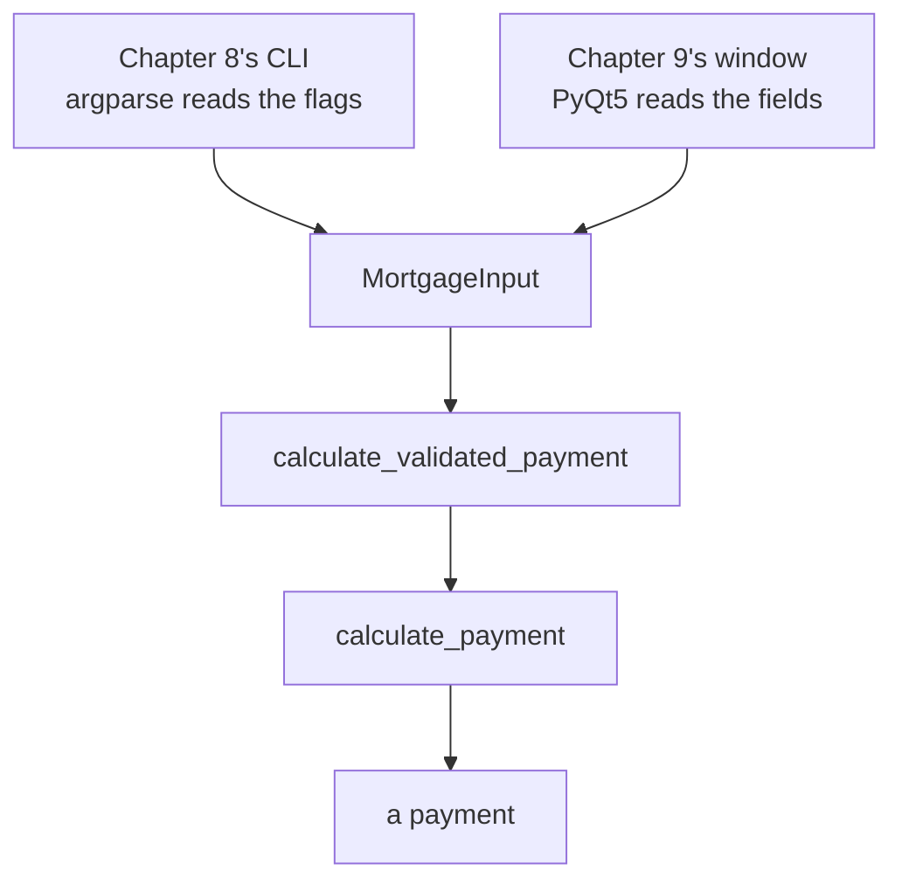
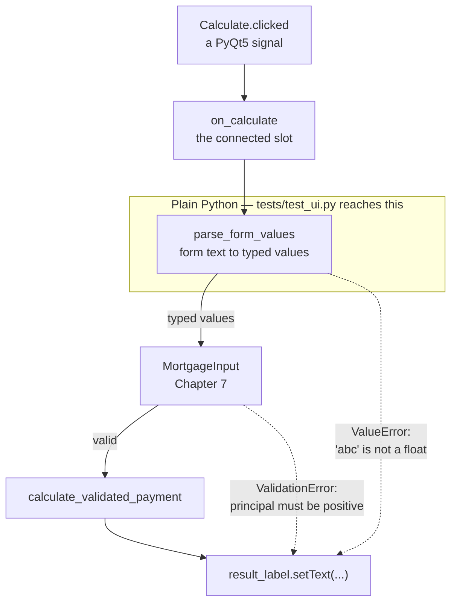

# Chapter 9 — Calculator UI

## 9.1 Why This Chapter Exists

Chapter 8 gave the calculator its first user-facing surface. This chapter gives it a second, entirely different one — a graphical desktop window — calling the exact same validation and core logic underneath. If Chapter 6's insistence on a pure core and Chapter 7's separate validation layer were worth the discipline, this chapter is where that discipline pays for itself directly: almost none of the code you write here will touch mortgage math at all.

By the end, you'll have a working PyQt5 window that takes the same four inputs as the CLI and produces the same result, with no duplicated calculation logic anywhere.

## 9.2 Two Front Ends, One Core

### 9.2.1 The Rule for This Chapter

Chapter 6.2 established that the core has no I/O. Chapter 7.7 established that `MortgageInput` and `calculate_validated_payment` are the one supported path into it. Nothing in this chapter changes either of those. This chapter only adds a new way to *call* that existing path — not a new way to compute anything.

Chapter 7.7.1's diagram, with exactly one thing added:



<!-- DIAGRAM BUILD NOTE: render this mermaid block to an image (e.g. via mermaid-cli) for the print/PDF build -- most PDF pipelines won't render mermaid syntax directly. -->

The new box is the one on the right of the top row. Everything below `MortgageInput` is character-for-character the same code Chapter 8 was already calling — not a parallel implementation, not a shared helper extracted after the fact, just the same functions called from somewhere new. If this chapter ends with anything below that line having changed, something has gone wrong.


### 9.2.2 What's Allowed to Change, and What Isn't

Allowed: how input is collected, how output is displayed, anything about layout, styling, and interaction. Not allowed: reimplementing any part of the payment calculation, or duplicating validation logic that already exists in `MortgageInput`. If you notice yourself writing an `if` statement that checks whether a number is positive, that's a sign you've drifted into re-doing Chapter 7's job instead of reusing it.

## 9.3 PyQt5 Basics

### 9.3.1 Installing

```bash
uv add pyqt5
```

### 9.3.2 The Smallest Possible Window

Try this as a real, throwaway script — a GUI genuinely needs to be seen, not just read about. Create it:

```bash
vi scratch_window.py
```

```python
import sys

from PyQt5.QtWidgets import QApplication, QWidget

app = QApplication(sys.argv)
window = QWidget()
window.setWindowTitle("Hello, PyQt5")
window.show()
sys.exit(app.exec_())
```

Run it:

```bash
uv run python scratch_window.py
```

A small, blank window titled "Hello, PyQt5" should appear. Nothing in it yet — that's expected; an empty `QWidget` is just a blank window, which is exactly what this checks: that PyQt5 is installed correctly and a window can actually open on your machine, before building anything real on top of it. Close the window the normal way for your platform — the script exits on its own once you do, since `app.exec_()` was waiting on exactly that.

`QApplication` manages the application as a whole — there's exactly one per program. `QWidget` is the base building block for anything visible; an empty one, as above, is just a blank window. `.show()` makes it visible, and `app.exec_()` starts the **event loop** — the process that waits for and responds to user interaction (clicks, typing, resizing) until the window is closed.

Delete the scratch file once you've seen it work — not part of the real project:

```bash
rm scratch_window.py
```

### 9.3.3 Core Widgets for This Project

- `QLineEdit` — a single-line text input, for the four numeric fields
- `QLabel` — non-editable text, for both field labels and the result display
- `QPushButton` — a clickable button, to trigger the calculation
- `QFormLayout` — arranges label/input pairs in neat rows, exactly the shape this calculator's input form needs
- `QVBoxLayout` — stacks widgets vertically; used here to stack the form, the button, and the result label

### 9.3.4 Signals and Slots

PyQt5's event handling works through **signals** (something happened — a button was clicked) connected to **slots** (a function that runs in response). `button.clicked.connect(some_function)` means: whenever this button is clicked, call `some_function`. That's the entire mechanism this project needs — PyQt5 has many more signal types, but this one covers everything the calculator does.

## 9.4 Designing the Calculator Window

### 9.4.1 Sketching the Layout

Four labeled inputs, matching `SPEC.md`'s fields exactly, a calculate button, and a result area below it:

```
Principal ($):           [____________]
Annual rate (e.g. 0.06): [____________]
Term (years):            [____________]
Payments per year:       [____________]

[ Calculate ]

Fixed periodic payment: $1,199.10
```

### 9.4.2 What's Worth Planning vs. What Isn't

The field order and labels above are worth deciding deliberately, since they directly mirror the spec. Exact pixel spacing, colors, and fonts are not worth planning in advance — PyQt5's defaults are perfectly usable, and this book treats visual polish as something to iterate on directly in code, not something to wireframe first.

## 9.5 Wiring the UI to Validation and the Core

### 9.5.1 The Full Window

In `src/mortgage_calculator_book/ui.py`:

```python
import sys

from PyQt5.QtWidgets import (
    QApplication,
    QFormLayout,
    QLabel,
    QLineEdit,
    QPushButton,
    QVBoxLayout,
    QWidget,
)
from pydantic import ValidationError

from mortgage_calculator_book.validation import (
    MortgageInput,
    calculate_validated_payment,
)


class MortgageCalculatorWindow(QWidget):
    def __init__(self):
        super().__init__()
        self.setWindowTitle("Mortgage Calculator")

        self.principal_input = QLineEdit()
        self.rate_input = QLineEdit()
        self.term_input = QLineEdit()
        self.frequency_input = QLineEdit("12")

        self.result_label = QLabel("")
        self.calculate_button = QPushButton("Calculate")
        self.calculate_button.clicked.connect(self.on_calculate)

        form = QFormLayout()
        form.addRow("Principal ($):", self.principal_input)
        form.addRow("Annual rate (e.g. 0.06):", self.rate_input)
        form.addRow("Term (years):", self.term_input)
        form.addRow("Payments per year:", self.frequency_input)

        layout = QVBoxLayout()
        layout.addLayout(form)
        layout.addWidget(self.calculate_button)
        layout.addWidget(self.result_label)
        self.setLayout(layout)

    def on_calculate(self) -> None:
        try:
            data = MortgageInput(
                principal=float(self.principal_input.text()),
                annual_rate=float(self.rate_input.text()),
                term_years=int(self.term_input.text()),
                payments_per_year=int(self.frequency_input.text()),
            )
        except (ValueError, ValidationError) as exc:
            self.result_label.setText(f"Error: {exc}")
            return

        payment = calculate_validated_payment(data)
        self.result_label.setText(
            f"Fixed periodic payment: ${payment:,.2f}"
        )


def main() -> None:
    app = QApplication(sys.argv)
    window = MortgageCalculatorWindow()
    window.show()
    sys.exit(app.exec_())


if __name__ == "__main__":
    main()
```

Run it now, before moving on — a GUI is worth confirming the moment it exists, not several sections later:

```bash
uv run python -m mortgage_calculator_book.ui
```

The window from 9.4.1's sketch should appear, for real this time: four labeled fields, a Calculate button, an empty result area below them. Don't worry about entering real numbers and checking the math yet — that's 9.8's full walkthrough, once 9.5.2's error handling and 9.7's testing have actually been covered. For now, just confirm it launches, looks right, and closes cleanly.

### 9.5.2 Displaying Errors in the UI

Notice `on_calculate` catches two different kinds of error: a plain `ValueError`, raised if `float(...)` or `int(...)` fails on genuinely non-numeric text (someone typing "abc" into the principal field), and `ValidationError`, raised by `MortgageInput` for numeric-but-invalid input (a negative principal, same as Chapter 8's CLI would reject). Both land in the same result label rather than crashing the application — a user typing garbage into a field should see a message, not watch the window disappear.

### 9.5.3 Displaying the Result

`f"${payment:,.2f}"` — the same formatting used in Chapter 8's CLI, for the same reason: consistent presentation between front ends, even though the underlying `payment` value is unrounded until this exact point (Chapter 6.8.3).

The window works end to end now — commit it:

```bash
git add src/mortgage_calculator_book/ui.py
git commit -m "Add calculator window wired to validation and the core"
git push
```

## 9.6 Where Agent Assistance Helps, and Where It Doesn't

### 9.6.1 Good Delegation, and a Trickier Request Bundled With It

The widget-creation and layout code in 9.5.1 is exactly the kind of task worth handing to Pi. Start by updating 9.4.1's sketch — a second pass at a design is normal, the same way SPEC.md gets revised more than once across this book, including right here in 9.6.2 below:

```
Principal ($):           [____________]
Annual rate (e.g. 0.06): [____________]
Term (years):            [____________]
Payments per year:       [____________]

[ Calculate ]  [ Clear ]

Fixed periodic payment: $1,199.10
```

Hand the updated sketch to Pi directly as the spec, and ask for tests in the same breath:

```bash
pi "Add a 'Clear' button next to Calculate that resets \
    all four input fields and the result label, matching \
    the updated layout in 9.4.1. Also add tests for it in \
    tests/test_ui.py."
```

The GUI half is exactly as mechanical as it looks: run the app, click the new button, confirm all four fields and the result label actually clear. Read the diff first, as always, but there's not much to catch — button wiring like this has an obviously correct answer.

The tests half is where this exercise earns its place. Watch for which of two very different directions Pi actually takes:

- **A widget-level test** — instantiate the window, click Clear, assert the fields are now empty. This doesn't strictly need a new dependency — PyQt5 itself can drive a widget directly in an offscreen `QApplication`, no `pytest-qt` required — but it does need real setup: an offscreen environment variable, a session-scoped fixture, a widget built just to click one button and check four fields are empty. If the proposal reaches for that machinery, or worse, quietly adds `pytest-qt` anyway without needing to, that's worth noticing: meaningfully more scaffolding than a Clear button warrants is a bigger, less obvious version of the exact problem 9.6.3 is about to raise with "make this look nicer" — more than was actually asked for, dressed up as thoroughness.
- **No test at all, with a note explaining why** — because unlike `parse_form_values` in 9.7.1, "clear four fields" has no logic to extract. `self.principal_input.clear()` four times over isn't a computation with a right answer to assert on; it's direct widget manipulation, indistinguishable in a test from the implementation itself. There's nothing a unit test buys here that clicking the button and looking doesn't already give you, faster.

The second answer is the right one. If Pi proposes the first, this is a case for declining it outright rather than accepting it and cleaning it up afterward: reject the new dependency, keep the manual click-and-check, and don't write a test just because one was asked for. 9.7.2 called this "the judgment of not over-testing" in the abstract; this is what it looks like when an actual proposal tests that judgment directly — agreeing to "add tests for it" doesn't obligate you to accept tests that don't earn their place.

`ui.py` has real, working changes since its last commit — commit them:

```bash
git add src/mortgage_calculator_book/ui.py
git commit -m "Add Clear button"
git push
```

### 9.6.2 Writing the Interface Into SPEC.md, Then Redoing It From There

9.4.1's sketch is a real design artifact, but it lives in this book, not in the project — the same gap Chapter 4.7.3 found in the derivation, and for the same reason: Pi can only read what's actually in the repository. SPEC.md doesn't describe the GUI at all right now, or the CLI either, for that matter — nothing has ever gone back and added them. Fix both, in the spirit of Chapter 2.2.1's rule for what belongs here: *what* the interface must provide, not *how* it's built — no `QPushButton`, no `PyQt5`, just the required fields, actions, and behavior.

```bash
vi SPEC.md
```

```markdown
## Interfaces
- Command-line interface (human-readable and JSON output)
- Desktop GUI:
  - Inputs: principal, annual rate, term (years), payments per year
  - Actions: Calculate (computes and displays the payment), Clear
    (resets all fields and the result)
  - Invalid input shows an error message in place, not a crash
```

Add this as its own section, near the top — right after "What it does" reads naturally. Commit it on its own:

```bash
git add SPEC.md
git commit -m "Document CLI and GUI interfaces in SPEC.md"
git push
```

Now delete `ui.py` and rebuild it from SPEC.md alone, the same shape as Chapters 7.6 and 8.6 — safe, since it's committed:

```bash
git rm src/mortgage_calculator_book/ui.py
git commit -m "Remove hand-written ui.py to redo from SPEC.md"
```

```bash
pi "Implement the GUI described in SPEC.md's Interfaces \
    section, in src/mortgage_calculator_book/ui.py, \
    wiring it to MortgageInput and \
    calculate_validated_payment from validation.py."
```

There's no test suite driving this one red-then-green the way 7.6 and 8.6 were — 9.7.1 already established why a GUI like this isn't unit-tested directly. Verify by hand instead, the same way 9.5.1 and 9.6.1 already did: run it, enter the Chapter 4.5 worked example, confirm `$1,199.10`, click Clear, confirm everything resets, try invalid input, confirm it shows an error rather than crashing.

```bash
uv run python -m mortgage_calculator_book.ui
```

Worth comparing against what you had before, the same way as 7.6.4 and 8.6.4:

```bash
git log --oneline -- src/mortgage_calculator_book/ui.py
```

Grab the hash for "Add Clear button" — the most recent commit to this file before the delete — and look at it:

```bash
git show <hash>:src/mortgage_calculator_book/ui.py
```

A reasonable rebuild from this spec should land on something structurally close to what you had by hand — reading the fields, building a `MortgageInput`, catching `ValidationError`, displaying the result — since that's the only obvious way to satisfy what SPEC.md now asks for. If Pi's version differs in some real way rather than just naming or ordering, that's worth understanding before moving on; section 9.7's extraction below assumes a shape like the original, and if what you actually have looks meaningfully different, adapt it rather than forcing a mismatch.

Once you're satisfied:

```bash
git add src/mortgage_calculator_book/ui.py
git commit -m "Rebuild ui.py from SPEC.md's Interfaces section"
git push
```

### 9.6.3 Poor Delegation: Layout and Visual Judgment

Asking Pi to "make this look nicer" invites a much harder review problem: "nicer" isn't a test you can run, and accepting a layout change sight-unseen means trusting an aesthetic judgment you haven't actually checked. Reviewing a UI diff correctly here means *running the application and looking at it* — reading the code alone won't tell you whether a change actually improved anything.

> **Process concept: "trust but verify" extended to a domain you check with your eyes.** Chapter 1.6 introduced verification as reading a diff. Most of this book's verification since then has been reading diffs and running tests. This is the first chapter where verification genuinely requires neither — it requires looking at the running application. Recognizing when a task needs that kind of check, rather than defaulting to "the tests still pass, so it's fine," is its own skill worth practicing here.

## 9.7 Testing UI Logic Where It's Worth It

### 9.7.1 What's Testable Without a Full GUI Framework

Testing PyQt5 windows directly — simulating clicks, reading rendered widget state — is possible without a new dependency: PyQt5 itself can drive a widget in an offscreen `QApplication`, no `pytest-qt` needed. But doing it properly — a session fixture, an offscreen environment variable, one test per interesting interaction — is real setup for a project this size, the same kind of scope call the Appendix makes for Docker or CI/CD: genuinely achievable, not what this book spends its pages on. Appendix A.7 sketches the technique directly, if you're curious now rather than later. What *is* cheap, regardless of that choice, is the parsing logic hiding inside `on_calculate`. Pull it out as its own function in `ui.py`:

```python
def parse_form_values(
    principal_text: str, rate_text: str, term_text: str, frequency_text: str
) -> dict:
    """Convert raw form text into the types MortgageInput expects."""
    return {
        "principal": float(principal_text),
        "annual_rate": float(rate_text),
        "term_years": int(term_text),
        "payments_per_year": int(frequency_text),
    }
```

And update `on_calculate` to call it:

```python
    def on_calculate(self) -> None:
        try:
            values = parse_form_values(
                self.principal_input.text(),
                self.rate_input.text(),
                self.term_input.text(),
                self.frequency_input.text(),
            )
            data = MortgageInput(**values)
        except (ValueError, ValidationError) as exc:
            self.result_label.setText(f"Error: {exc}")
            return

        payment = calculate_validated_payment(data)
        self.result_label.setText(
            f"Fixed periodic payment: ${payment:,.2f}"
        )
```

That extraction splits the click path into two halves with very different testing stories:



<!-- DIAGRAM BUILD NOTE: render this mermaid block to an image (e.g. via mermaid-cli) for the print/PDF build -- most PDF pipelines won't render mermaid syntax directly. -->

Everything inside the box is ordinary Python with no window attached, which is why it can be tested for the price of an import. Everything outside it is widget behavior — a signal firing, a label's text changing — which 9.7.2 decides to check by clicking the button and looking, rather than by building the offscreen machinery Appendix A.7 describes. The diagram also shows why both error arrows land in the same place: 9.5.2's two exception types come from two different steps, but a user only ever needs one message in one spot.

Now `parse_form_values` is a plain function, testable with no `QApplication` involved at all:

```python
# tests/test_ui.py
import pytest

from mortgage_calculator_book.ui import parse_form_values


def test_parses_valid_form_values():
    result = parse_form_values("200000", "0.06", "30", "12")
    assert result == {
        "principal": 200000.0,
        "annual_rate": 0.06,
        "term_years": 30,
        "payments_per_year": 12,
    }


def test_raises_on_non_numeric_principal():
    with pytest.raises(ValueError):
        parse_form_values("not a number", "0.06", "30", "12")
```

Run it:

```bash
pytest tests/test_ui.py -v
```

Both pass — this file needed no GUI, no window, no `QApplication`, to genuinely verify. That's the whole point of pulling `parse_form_values` out on its own in the first place.

### 9.7.2 The Judgment of Not Over-Testing

Notice what's deliberately absent here: no test clicks the actual button, no test checks the actual label text on screen. That's not laziness, and it's not because it can't be done — 9.7.1 already showed it's achievable without a new dependency. It's a decision that the setup cost (an offscreen `QApplication`, a session fixture) isn't worth it for this project, given how cheaply the same thing can be checked by hand (9.6.3). Knowing where to stop testing is as much a skill as knowing where to start.

## 9.8 Running the App

### 9.8.1 A Walkthrough

```bash
uv run python -m mortgage_calculator_book.ui
```

Enter the Chapter 4.5 worked example — `200000`, `0.06`, `30`, `12` — click Calculate, and confirm the window shows `$1,199.10`, matching every other front end this project has produced so far.

### 9.8.2 Packaging, Briefly

Turning this into a double-clickable application (a `.app` on macOS, an `.exe` on Windows) is a real, separate topic — tools like PyInstaller handle it, but it's genuinely out of scope for this book. Flagged here, and covered properly in Appendix A.8, rather than left as a mystery.

## 9.9 Refactor and Ruff Pass

```bash
ruff check . && ruff format .
```

If `ruff check` reports anything, `ruff check --fix .` (3.4.3) is usually the fastest way to clear it before looking at whatever's left by hand.

`parse_form_values` and `tests/test_ui.py` from 9.7 have been sitting uncommitted since they were written — the last loose end from this chapter:

```bash
git add src/mortgage_calculator_book/ui.py tests/test_ui.py
git commit -m "Extract parse_form_values and test it"
git push
```

## 9.10 Checkpoint

Before moving to Chapter 10, this should all be true:

- [ ] The PyQt5 window opens and displays four labeled input fields, a Calculate button, and a result area
- [ ] The Clear button (9.6.1) resets all four fields and the result label, verified by clicking it — not by an added GUI-testing dependency
- [ ] `SPEC.md` has an "Interfaces" section documenting both the CLI and the GUI, committed (9.6.2)
- [ ] `ui.py` was rebuilt from that spec via Pi and re-verified by hand, not left as the original hand-written version
- [ ] Entering the Chapter 4.5 worked example produces `$1,199.10`
- [ ] Invalid input (non-numeric text, or values `MortgageInput` rejects) shows an error message instead of crashing
- [ ] `parse_form_values` exists as a standalone, tested function
- [ ] No mortgage math or validation logic is duplicated anywhere in `ui.py` — it all still lives in `core.py` and `validation.py`
- [ ] `ruff check .` and `ruff format .` both pass
- [ ] Everything from this chapter is committed and pushed — `ui.py`, `SPEC.md`, and `test_ui.py` alike, not just the pieces that felt like real commits at the time

**What's next:** Chapter 10 builds a third front end — not for a human this time, but for a language model, exposing the same validated core as a callable tool.
