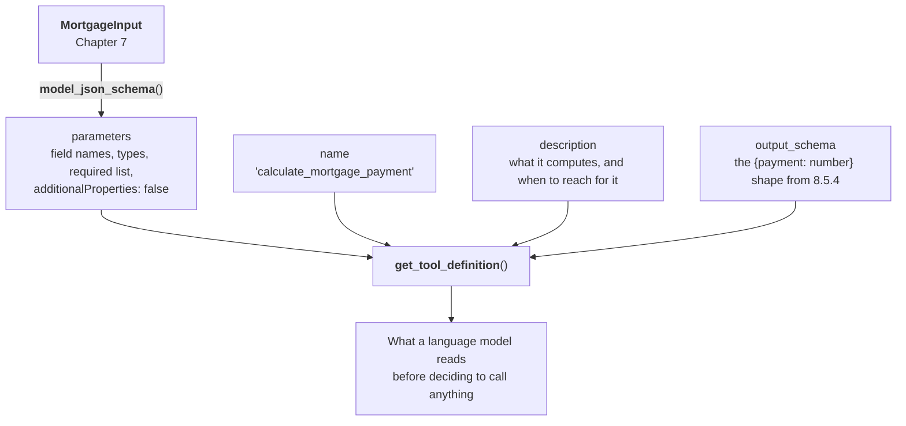
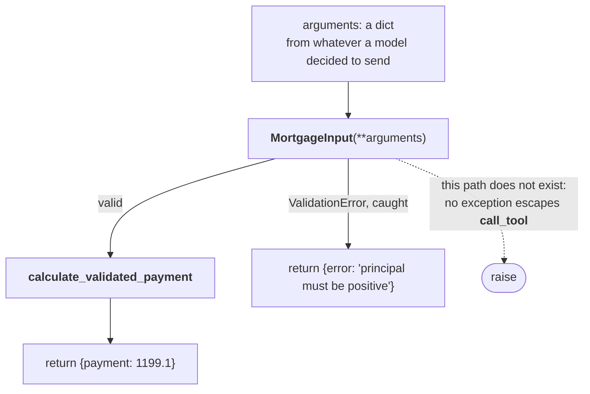
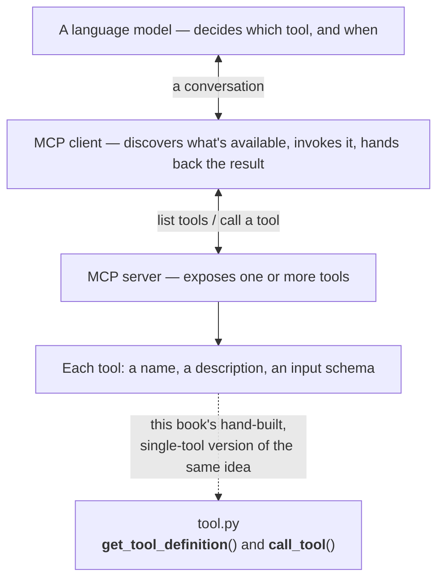

# Chapter 10 — Tool Interface

## 10.1 Why This Chapter Exists

Chapters 8 and 9 gave the calculator two front ends for humans. This chapter builds a third — one for a language model. By the end, you'll have a callable, schema-defined tool wrapping the exact same validated core those earlier chapters used, fully tested, and verified by hand with a simulated tool call. Chapter 11 is where an actual model gets to use it; this chapter is entirely about building and proving the contract first.

## 10.2 What a "Tool" Means in This Context

### 10.2.1 The Core Idea

A "tool," in the context of language models, is nothing more mysterious than: a function description plus a schema, written in a form a model can read, that tells it what the function does, what arguments it needs, and what it returns. The model doesn't execute anything itself — it decides *when* to call the tool and *what arguments to pass*, and your code does the actual work and hands the result back. It's a very structured, very constrained API, not a new kind of programming.

### 10.2.2 A Third Front End, Not a New Architecture

Exactly like Chapter 9's opening argument: this chapter follows the same rule Chapters 6 and 7 established. `calculate_payment` stays pure. `MortgageInput` and `calculate_validated_payment` remain the one supported path into it. This chapter adds a way for a *model* to reach that path, the same way Chapters 8 and 9 added ways for a *human* to reach it.

### 10.2.3 Validation-as-Schema, Revisited

Chapter 7.2.3 flagged this moment directly: a Pydantic model is already most of the way to a tool schema. This chapter is where that foreshadowing pays off.

## 10.3 Reusing the Pydantic Models

### 10.3.1 Free JSON Schema

What is a schema, exactly? A description of the *shape* data is expected to have — which fields exist, what type each one is, which are required — written so a program can read it, not just a person. It's not the data itself, any more than a form's blank fields are the answers someone eventually writes into them; it's a specification of what valid data looks like, checkable before anything is actually filled in. **JSON Schema** just means that description is itself written as JSON — which is exactly why it's the format most LLM tool-calling interfaces expect for describing valid arguments: a model needs to know a tool's expected shape before it can call it correctly.

Pydantic models can export their structure as JSON Schema with a single method call. Try it directly, the same REPL technique as 7.4.3:

```bash
uv run python
```

```python
from mortgage_calculator_book.validation import MortgageInput
import json

print(json.dumps(MortgageInput.model_json_schema(), indent=2))
```

You should see something close to this:

```json
{
  "additionalProperties": false,
  "description": "Validated input for a fixed-rate mortgage payment calculation.",
  "properties": {
    "principal": {
      "title": "Principal",
      "type": "number"
    },
    "annual_rate": {
      "title": "Annual Rate",
      "type": "number"
    },
    "term_years": {
      "title": "Term Years",
      "type": "integer"
    },
    "payments_per_year": {
      "default": 12,
      "title": "Payments Per Year",
      "type": "integer"
    }
  },
  "required": [
    "principal",
    "annual_rate",
    "term_years"
  ],
  "title": "MortgageInput",
  "type": "object"
}
```

Exit when you're done: **Ctrl+D**.

This dictionary describes every field's type, and — because your `field_validator`s already enforce them — you got the *shape* of the constraints (types, required fields) for free, with no extra code. Now inspect it for what's just as tellingly *missing*: none of Chapter 7.5's actual business rules show up anywhere. `principal` just says `"type": "number"` — nothing here hints that it rejects zero or negative values, or that `annual_rate` has to stay under 1.0. The specific rules inside your validators aren't expressed in the exported schema itself, but they still run every time `MortgageInput` is constructed — which matters, because it means the tool can't be tricked into skipping validation just because the schema alone doesn't spell out every rule.

One constraint *does* show up on its own, though, and it's worth noticing why: `"additionalProperties": false` appears at the top of the printed schema, correctly advertising that this model rejects fields it doesn't recognize — because Chapter 7.5.1's `model_config = ConfigDict(extra="forbid")` makes that true at runtime, and Pydantic reflects real runtime behavior into the generated schema automatically. Fix a constraint at the model, the one place this project defines what "valid" means, and both the enforcement and the advertisement of it come free from the same line — no separate schema to keep in sync by hand.

### 10.3.2 What Still Needs to Be Added

A schema alone isn't a complete tool definition — a model also needs a **name** it can refer to, and a **description** written in prose that tells it what the tool is *for* and *when to use it*. Neither of those come from the Pydantic model; both are new content for this chapter.

Four parts go into the finished definition, and it's worth being clear about which of them you already have:



<!-- DIAGRAM BUILD NOTE: render this mermaid block to an image (e.g. via mermaid-cli) for the print/PDF build -- most PDF pipelines won't render mermaid syntax directly. -->

Only the top branch is free. `parameters` falls out of a model you already wrote and already test, which is 7.2.3's foreshadowing paying off exactly as promised. The other three boxes are new writing — and of those, `description` is the only one in this entire project whose quality is judged by a language model rather than by a test, which is why 10.4.1 treats it as prompt engineering rather than documentation.

## 10.4 Defining the Tool Contract

Everything in this section goes into one new file — `src/mortgage_calculator_book/tool.py`, sitting alongside `cli.py` and `ui.py` as a peer front end, not folded into either. Create it now:

```bash
vi src/mortgage_calculator_book/tool.py
```

### 10.4.1 Writing the Description

This is prompt engineering in miniature — worth treating with real care, since a vague or ambiguous description directly affects whether a model calls the tool correctly, or at all:

```python
TOOL_NAME = "calculate_mortgage_payment"

TOOL_DESCRIPTION = (
    "Calculate the fixed periodic payment for a fixed-rate mortgage, given "
    "a principal amount, an annual interest rate, a loan term in years, "
    "and how many payments are made per year. Use this whenever the user "
    "asks about a mortgage payment amount for a fixed-rate loan."
)
```

Notice the second sentence does real work: it's not just describing what the function computes, it's telling the model *when* reaching for it is appropriate — language a schema alone can't express.

### 10.4.2 The Output Schema

Reusing the exact shape from Chapter 8.5.4's forward-note — `{"payment": 1199.10}` — rather than inventing a new one. Same file, appended below what's already there:

```python
OUTPUT_SCHEMA = {
    "type": "object",
    "properties": {
        "payment": {
            "type": "number",
            "description": "The fixed periodic payment, in dollars.",
        }
    },
    "required": ["payment"],
}
```

## 10.5 TDD the Contract Before Wiring Anything Up

### 10.5.1 Tests First, No Model Involved

```python
# tests/test_tool.py
import pytest

from mortgage_calculator_book.tool import call_tool, get_tool_definition


def test_valid_call_returns_payment():
    result = call_tool(
        {
            "principal": 200000,
            "annual_rate": 0.06,
            "term_years": 30,
            "payments_per_year": 12,
        }
    )
    assert result["payment"] == pytest.approx(1199.10, abs=0.01)


def test_invalid_call_returns_error_dict_not_exception():
    result = call_tool(
        {"principal": -1000, "annual_rate": 0.06, "term_years": 30}
    )
    assert "error" in result


def test_tool_definition_has_name_and_description():
    definition = get_tool_definition()
    assert definition["name"] == "calculate_mortgage_payment"
    assert "mortgage" in definition["description"].lower()
    assert "properties" in definition["parameters"]
    assert "payment" in definition["output_schema"]["properties"]
```

Those three tests describe a function with exactly two exits and no third one:



<!-- DIAGRAM BUILD NOTE: render this mermaid block to an image (e.g. via mermaid-cli) for the print/PDF build -- most PDF pipelines won't render mermaid syntax directly. -->

The dotted path is the whole point of this section. Chapter 6's core and Chapter 7's validation are both allowed to raise, because a human reading a traceback can act on it. Chapter 11's model-calling loop can't — it needs something to hand *back to the model* whichever way the call went, and an exception is not that. Two predictable dictionary shapes, always.

Note the second test's name specifically: `call_tool` must return an **error dictionary**, not raise an exception — a meaningfully different contract than Chapter 6's core or Chapter 7's validation, both of which are allowed to raise. A model-calling layer in Chapter 11 needs to hand *something* back to the model on bad input; an uncaught exception isn't something a model-calling loop can pass along gracefully.

### 10.5.2 Confirming Errors Are Handleable

This is worth stating as its own requirement, separate from "the function shouldn't crash": the shape of an error response (`{"error": "..."}`) needs to be just as predictable as the shape of a success response, since Chapter 11's wiring will need to check for one or the other every single time.

### 10.5.3 Agent-Assisted Implementation

```bash
pi "Implement call_tool and get_tool_definition in \
    src/mortgage_calculator_book/tool.py to make the \
    tests in tests/test_tool.py pass. call_tool should \
    never raise — catch validation errors and return an \
    error dict instead."
```

Review as always — this chapter's implementation:

```python
from typing import Any

from pydantic import ValidationError

from mortgage_calculator_book.validation import (
    MortgageInput,
    calculate_validated_payment,
)


def get_input_schema() -> dict[str, Any]:
    return MortgageInput.model_json_schema()


def get_tool_definition() -> dict[str, Any]:
    return {
        "name": TOOL_NAME,
        "description": TOOL_DESCRIPTION,
        "parameters": get_input_schema(),
        "output_schema": OUTPUT_SCHEMA,
    }


def call_tool(arguments: dict[str, Any]) -> dict[str, Any]:
    """Validate arguments, compute the payment, and return a result or an
    error dict. Never raises — a model-calling layer needs something to
    hand back to the model either way."""
    try:
        data = MortgageInput(**arguments)
    except ValidationError as exc:
        return {"error": "; ".join(e["msg"] for e in exc.errors())}

    payment = calculate_validated_payment(data)
    return {"payment": round(payment, 2)}
```

## 10.6 Sidebar: Model Context Protocol (MCP)

### 10.6.1 What You Just Built, Named

What `get_tool_definition` and `call_tool` implement by hand — a name, a description, a schema, and a function that executes against validated arguments — is a small, simplified version of a real, standardized protocol called **Model Context Protocol (MCP)**. MCP defines a common way for an application to expose tools like this one to a language model, and for a model-calling client to discover and invoke them, without every project inventing its own bespoke format.

### 10.6.2 The Shape of MCP, Conceptually

At a high level: an MCP **server** exposes one or more tools, each described the way `TOOL_DESCRIPTION` and `get_input_schema()` describe this one. An MCP **client** — the thing actually talking to a language model — discovers what tools are available and handles calling them when the model asks. This book doesn't implement MCP itself; building `tool.py` by hand, understanding exactly what each piece is for, is meant to make the real protocol legible later rather than an opaque black box the first time you encounter it.



<!-- DIAGRAM BUILD NOTE: render this mermaid block to an image (e.g. via mermaid-cli) for the print/PDF build -- most PDF pipelines won't render mermaid syntax directly. -->

Read the dotted arrow as the whole point of this sidebar. Nothing in this project speaks MCP, and nothing needs to — but the four boxes it points at are the same four you assembled by hand in 10.4, which is why the protocol should read as familiar rather than novel the first time you meet it in a real project.


### 10.6.3 Why This Matters

Connecting this chapter's exercise to something real, standardized, and widely used means what you've built here isn't just a toy pattern specific to this book — it's a smaller version of an approach you're likely to run into again.

## 10.7 Manual Verification: Calling the Tool Like a Model Would

### 10.7.1 A Simulated Call

Before Chapter 11 puts a real model in the driver's seat, confirm the tool works exactly the way a model-calling layer would use it — JSON in, JSON out:

```python
# scratch_verify_tool.py — not part of the test suite, just a manual check
import json

from mortgage_calculator_book.tool import call_tool

request = json.loads(
    '{"principal": 200000, "annual_rate": 0.06, '
    '"term_years": 30, "payments_per_year": 12}'
)
response = call_tool(request)
print(json.dumps(response))
# {"payment": 1199.1}
```

```bash
uv run python scratch_verify_tool.py
```

### 10.7.2 The Last Checkpoint Before a Real Model

This confirms the whole path works end to end — JSON arguments in, a validated calculation, JSON results out — using nothing but the exact mechanism a model will use in Chapter 11. Delete `scratch_verify_tool.py` once you've run it; it was a check, not a permanent part of the project.

## 10.8 Refactor and Ruff Pass

```bash
ruff check . && ruff format .
```

## 10.9 Checkpoint

Before moving to Chapter 11, this should all be true:

- [ ] `get_tool_definition()` returns a name, a description, a parameters schema derived from `MortgageInput`, and the output schema from 10.4.2
- [ ] `call_tool()` returns `{"payment": ...}` on valid input and `{"error": ...}` on invalid input — and never raises
- [ ] All tests in `tests/test_tool.py` pass
- [ ] You've manually verified a JSON-in, JSON-out call against the Chapter 4.5 worked example
- [ ] You can explain, in a sentence, what MCP is and how what you built here relates to it
- [ ] `ruff check .` and `ruff format .` both pass

**What's next:** Chapter 11 gives a real language model — local first, then hosted — the ability to call this tool, completing the hybrid system end to end for the first time.
