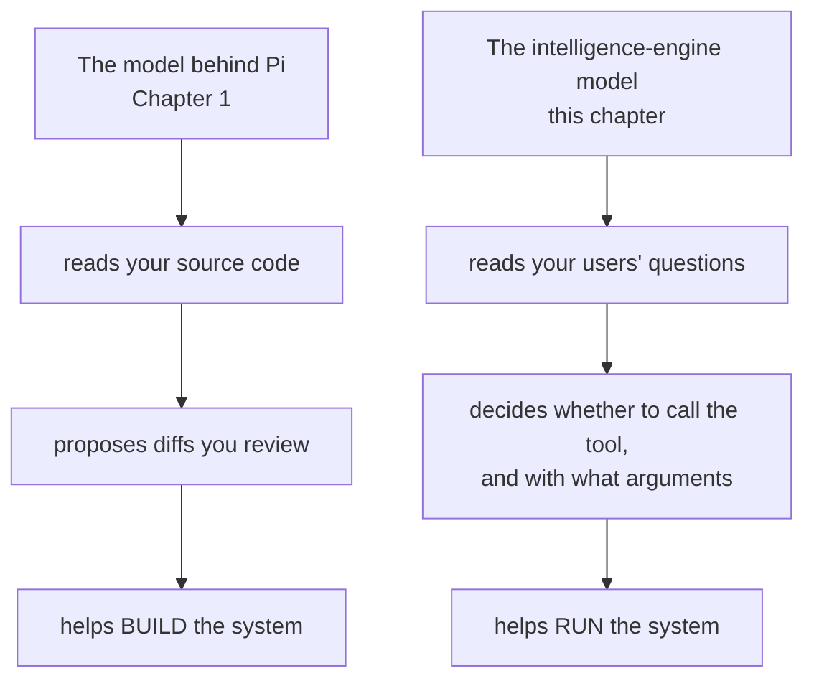
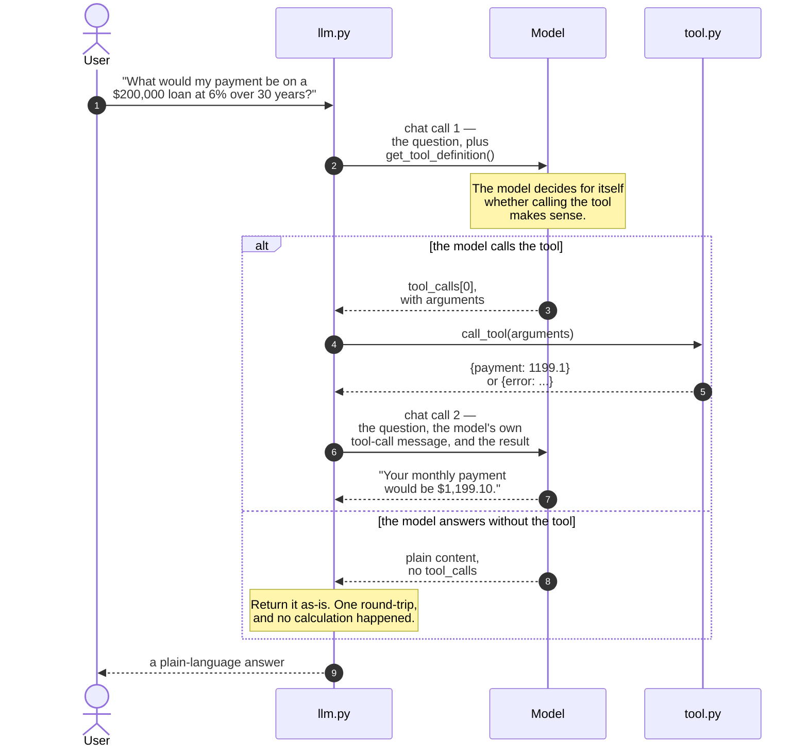
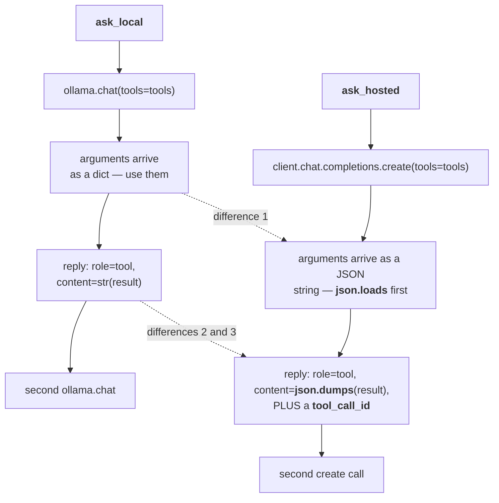
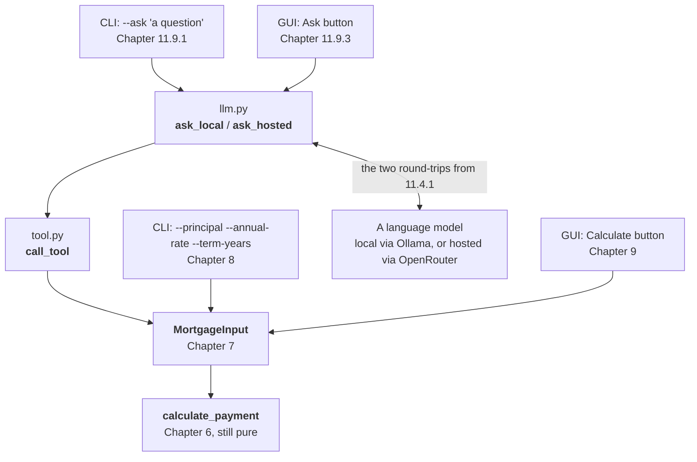

# Chapter 11 — LLM Interface: Enter A Second Model

## 11.1 Why This Chapter Exists

Chapter 10 proved the tool works when called manually, with arguments you typed yourself. This chapter hands that same tool to a language model, and lets the model decide when and how to call it. By the end, you'll be able to ask the calculator a plain-language question — "What would my payment be on a $200,000 loan at 6% over 30 years?" — and get back a real, computed answer, through both a local model and a hosted one. This is the chapter where the hybrid system this book has been building toward finally exists, end to end.

## 11.2 Two Models, Two Jobs

### 11.2.1 Explicitly Distinguishing the Roles

Two different local language models will exist in this project by the end of this chapter, and it's worth being precise about why: the model behind Pi (Chapter 1) helped *build* the system — reading code, proposing diffs, drafting tests. The model this chapter adds helps *run* the system — reading a user's plain-language question and deciding whether and how to call the Chapter 10 tool. Same underlying technology, genuinely different jobs.



<!-- DIAGRAM BUILD NOTE: render this mermaid block to an image (e.g. via mermaid-cli) for the print/PDF build -- most PDF pipelines won't render mermaid syntax directly. -->

Two lanes that never touch. They're judged on different things too, which is 11.2.2's point: the top lane is judged on reasoning across several files of code, the bottom on producing well-formed tool arguments reliably. A model that's excellent at one has told you nothing about the other, which is why this chapter pulls a second model rather than reusing the one already installed.


### 11.2.2 Why the Same Model Isn't Necessarily Right for Both

A model chosen for coding assistance is judged on things like how well it reads and reasons about source code across multiple files. A model chosen for this chapter's job is judged on something narrower and more specific: how reliably it calls a tool with correctly formatted arguments, and how sensibly it responds once it has a result back. A model that's excellent at one of these isn't guaranteed to be excellent at the other — which is exactly why this chapter pulls a second model rather than reusing Pi's.

> **Process concept: naming the distinction once both models exist.** Chapter 1.2.3 flagged that a second model job was coming, without saying much more about it. Now that both models actually exist side by side in this project, the distinction is concrete rather than theoretical: one model's job is understanding *your code*; the other's job is understanding *your users' questions*.

## 11.3 Choosing a Local Model for the Intelligence Engine

### 11.3.1 What Matters for This Job

Raw coding ability isn't the priority here — reliable, correctly formatted tool-calling behavior is. A smaller model that reliably produces well-formed tool calls is more useful for this job than a larger, more broadly capable model that occasionally gets the arguments wrong or forgets to call the tool at all.

### 11.3.2 Pulling a Second Model

```bash
ollama pull qwen3:8b
```

Sized against the same hardware gut-check table from Chapter 1.4.3 — if your machine comfortably runs the larger model behind Pi, it will run this one without issue; if it doesn't, this is a good chance to try a smaller model specifically for this narrower job.

### 11.3.3 A Standalone Conversation First

Before wiring anything to the tool, talk to this model the same way you did in Chapter 1.3.3:

```bash
ollama run qwen3:8b
```

Ask it a mortgage-related question directly, with no tool available — the same $200,000/6%/30-year question from Chapter 4.5. One of two things happens, and it's worth being honest that the better-sounding one isn't actually the reassuring one.

Sometimes the model answers in general terms, or admits it can't compute an exact figure — useful context on its own for appreciating what the tool wiring in section 11.4 adds.

But a reasoning model like this one is just as likely to work through the whole amortization formula inside its own "thinking" output — converting the rate, computing $(1.005)^{360}$, dividing, multiplying — and land on **$1,199.10**, matching Chapter 4.5's answer exactly. If that's what you see, don't read it as evidence the tool is unnecessary. Read it the opposite way. Run it again with `--verbose` and look at what that correct answer actually cost: on ordinary consumer hardware, a real run of this exact question took **61.8 seconds** and **5,107 tokens** of reasoning to reach a number `calculate_payment` returns in about **0.3 microseconds** — not a rounding difference, but roughly 193 million times slower for the identical result. And ask yourself how you'd actually know if one of those 5,107 tokens had gotten the arithmetic slightly wrong along the way — the same question 4.6 and 5.6.4 already asked you to ask about any other model output. Getting it right once, watched closely by someone who already knew the answer, isn't the same claim as getting it right reliably, unwatched, for a question you didn't already know the answer to, in a minute instead of a fraction of a millionth of a second. That gap — not raw capability — is what section 11.4 is actually for.

## 11.4 Wiring the Local Model to the Chapter 10 Tool

### 11.4.1 The Request/Response Shape

The pattern this section implements has four steps: a user asks a question; the model, given the Chapter 10 tool definition, decides whether to call it and with what arguments; your code executes the tool and gets a result; that result goes back to the model, which turns it into a plain-language answer.

Those four steps take **two** round-trips to the model, not one, and that is the single detail most worth getting straight before reading the code:



<!-- DIAGRAM BUILD NOTE: render this mermaid block to an image (e.g. via mermaid-cli) for the print/PDF build -- most PDF pipelines won't render mermaid syntax directly. -->

Three things this makes concrete that the prose has to say three separate times. The model never touches `call_tool` — it asks, your code executes, and the arrow from `tool.py` goes back to `llm.py`, not to the model. The second `chat` call replays the *whole* conversation, including the model's own tool-call message, because the model holds no memory between calls; leave that message out and the tool result arrives with nothing to attach itself to. And the `else` branch is not an error — a model choosing not to call the tool is normal behavior, which is why 11.4.3 treats it as something to expect and Chapter 12 makes it a scored outcome rather than a bug.

### 11.4.2 A Minimal Implementation

```bash
uv add ollama
```

In `src/mortgage_calculator_book/llm.py`:

```python
import ollama

from mortgage_calculator_book.tool import call_tool, get_tool_definition

LOCAL_MODEL = "qwen3:8b"


def ask_local(question: str) -> str:
    # Ollama expects tools as a list of {"type": "function", ...}
    # entries wrapping the exact name/description/parameters Chapter 10's
    # get_tool_definition() already produces.
    tool_def = get_tool_definition()
    tools = [
        {
            "type": "function",
            "function": {
                "name": tool_def["name"],
                "description": tool_def["description"],
                "parameters": tool_def["parameters"],
            },
        }
    ]

    # First call: hand the model the question and the tool it's allowed
    # to use. The model decides for itself whether calling it makes sense
    # here — nothing forces it to.
    first = ollama.chat(
        model=LOCAL_MODEL,
        messages=[{"role": "user", "content": question}],
        tools=tools,
    )
    message = first["message"]
    tool_calls = message.get("tool_calls")

    if not tool_calls:
        # The model chose to answer without calling the tool at all.
        return message["content"]

    # Only one tool exists in this project, so only the first call
    # matters — a project with several tools would need to loop here.
    call = tool_calls[0]
    result = call_tool(call["function"]["arguments"])

    # Second call: replay the conversation so far (the question, then the
    # model's own tool-call message), and append the tool's result as a
    # "tool" message. str(result) turns the {"payment": ...} or {"error":
    # ...} dict into text, since that's what this role expects here.
    second = ollama.chat(
        model=LOCAL_MODEL,
        messages=[
            {"role": "user", "content": question},
            message,
            {"role": "tool", "content": str(result)},
        ],
    )
    # The model reads the tool's result and turns it into a normal,
    # plain-language answer — this is that final answer.
    return second["message"]["content"]
```

*(Ollama's exact tool-calling response shape can differ slightly between versions — check `ollama.chat`'s current documentation if a field name here doesn't match what you see. The pattern — two chat calls, with the tool's result inserted between them — stays the same regardless.)*

Try it now, the same way as every other piece of this project — a small, throwaway script, not just code on the page:

```bash
vi scratch_llm_local.py
```

```python
from mortgage_calculator_book.llm import ask_local

question = (
    "What would my payment be on a $200,000 loan at 6% over 30 years?"
)
print(ask_local(question))
```

Run it:

```bash
uv run python scratch_llm_local.py
```

This calls the real local model, which means it's slower than anything else you've run so far — expect several seconds, not the instant response of a test suite. You're looking for a plain-language answer containing `$1,199.10`, matching Chapter 4.5's worked example. If you get something else — a refusal, a different number, no tool call at all — that's not necessarily wrong; it's 11.4.3's territory, coming up next. Delete the scratch file once you've seen it work:

```bash
rm scratch_llm_local.py
```

### 11.4.3 When the Model Gets It Wrong

Two failure modes are worth expecting rather than being surprised by: the model might answer a mortgage question in general terms without calling the tool at all, even when it should have, or it might call the tool with malformed or incomplete arguments. Neither is a bug in your code — it's the model's behavior, and it's exactly why Chapter 10.5.1 insisted `call_tool` return an error dictionary rather than raise: a malformed call still gets *something* sensible back, which the model can then read and potentially recover from on its own.

## 11.5 Environment Variables in Practice

### 11.5.1 Where the Chapter 8 Pattern Finally Gets Used

Chapter 8.7 set up `.env`, `.env.example`, and `config.py` well before there was anything to put in them. This is that payoff:

```bash
# .env (not committed)
OPENROUTER_API_KEY=sk-or-v1-your-real-key-here
```

`config.py`, unchanged since Chapter 8.7.2, already loads this correctly — nothing new to write here, only a real value to add.

### 11.5.2 Config Alongside the Secret

Worth adding one more constant to `config.py` while you're there, since section 11.6 will need it:

```python
HOSTED_MODEL = "qwen/qwen3.8-27b"
```

Keeping the model name in config, rather than hardcoded inline, means switching models later is a one-line change.

## 11.6 OpenRouter & Paying for Models

### 11.6.1 What OpenRouter Is, and When Local Isn't Enough

OpenRouter provides API access to many hosted language models — including larger, more capable versions of models you may be running locally — through a single, consistent interface. It's worth reaching for when your local model's context window is too small, when local tool-calling reliability isn't good enough for what you're building, or when you simply don't have hardware capable of running something larger.

### 11.6.2 Account, Key, and Storage

Create an account at [openrouter.ai](https://openrouter.ai), generate an API key, and store it exactly the way section 11.5.1 described — never hardcoded, never committed.

### 11.6.3 Understanding Cost

OpenRouter charges per token, with rates that vary by model — larger, more capable models cost more per request. Set a spending limit on your account before making your first real call, and check the usage dashboard after your first few requests so you have a concrete sense of what a typical calculator query actually costs. For a project this size, expect the cost of testing this chapter's code to be a small fraction of a dollar — but it's worth confirming that for yourself rather than taking it on faith.

### 11.6.4 Wiring OpenRouter In

OpenRouter exposes an OpenAI-compatible API, so the OpenAI Python library works against it directly:

```bash
uv add openai
```

Same file as 11.4.2, `src/mortgage_calculator_book/llm.py` — `ask_hosted` sits alongside `ask_local`, not replacing it:

```python
import json

from openai import OpenAI

from mortgage_calculator_book.config import HOSTED_MODEL, OPENROUTER_API_KEY
from mortgage_calculator_book.tool import call_tool, get_tool_definition

# One client, reused across every call — no need to reconnect per question.
_client = OpenAI(
    base_url="https://openrouter.ai/api/v1", api_key=OPENROUTER_API_KEY
)


def ask_hosted(question: str) -> str:
    # Same tool shape as ask_local — OpenAI's format and Ollama's happen
    # to agree here, which is part of why get_tool_definition() didn't
    # need to change to support a second client.
    tool_def = get_tool_definition()
    tools = [
        {
            "type": "function",
            "function": {
                "name": tool_def["name"],
                "description": tool_def["description"],
                "parameters": tool_def["parameters"],
            },
        }
    ]

    first = _client.chat.completions.create(
        model=HOSTED_MODEL,
        messages=[{"role": "user", "content": question}],
        tools=tools,
    )
    message = first.choices[0].message

    if not message.tool_calls:
        return message.content

    # Only the first tool call matters, same as ask_local — one tool, one
    # call. Arguments arrive as a JSON string here, not a dict, so they
    # need parsing before call_tool can use them.
    call = message.tool_calls[0]
    arguments = json.loads(call.function.arguments)
    result = call_tool(arguments)

    # Two real differences from ask_local, easy to miss: OpenAI's API
    # requires a tool_call_id on the reply, linking this result back to
    # the specific call that requested it, and it expects the content as
    # an actual JSON string (json.dumps), not Python's str().
    second = _client.chat.completions.create(
        model=HOSTED_MODEL,
        messages=[
            {"role": "user", "content": question},
            message,
            {
                "role": "tool",
                "tool_call_id": call.id,
                "content": json.dumps(result),
            },
        ],
    )
    return second.choices[0].message.content
```

Notice how closely this mirrors `ask_local` from 11.4.2 — same four-step shape, same `call_tool` function reused without modification. That's the tool contract from Chapter 10 doing exactly the job it was built for: one interface, usable from more than one model-calling client.

Closely, but not identically. Three things genuinely differ, and all three are the kind that fail quietly:



<!-- DIAGRAM BUILD NOTE: render this mermaid block to an image (e.g. via mermaid-cli) for the print/PDF build -- most PDF pipelines won't render mermaid syntax directly. -->

Everything not touched by a dotted arrow is the same in both. Those three are worth memorising before 11.8.2 asks you to review Pi's version of `ask_hosted`, because none of them raises an exception when you get it wrong — a forgotten `json.loads` hands `call_tool` a string, a missing `tool_call_id` gets the second call rejected, and `str()` where `json.dumps()` belongs produces almost-JSON the model may or may not read correctly.


Try it the same way as 11.4.2, with a scratch file of its own:

```bash
vi scratch_llm_hosted.py
```

```python
from mortgage_calculator_book.llm import ask_hosted

question = (
    "What would my payment be on a $200,000 loan at 6% over 30 years?"
)
print(ask_hosted(question))
```

Run it:

```bash
uv run python scratch_llm_hosted.py
```

This one costs a small fraction of a cent and should return considerably faster than 11.4.2's local run — worth noticing directly, since 11.7 asks you to compare the two more formally in a moment. You're looking for the same answer as before, `$1,199.10`. Delete the scratch file once you've seen it work:

```bash
rm scratch_llm_hosted.py
```

`llm.py` has been sitting uncommitted since `ask_local` was first written in 11.4 — both functions are real and working now, worth a checkpoint:

```bash
git add src/mortgage_calculator_book/llm.py
git commit -m "Add ask_local and ask_hosted"
git push
```

## 11.7 Comparing Local vs. Hosted, Informally

### 11.7.1 Running the Same Questions Through Both

One more scratch file, this time running both paths back to back:

```bash
vi scratch_llm_compare.py
```

```python
from mortgage_calculator_book.llm import ask_hosted, ask_local

question = (
    "What would my monthly payment be on a $200,000 loan "
    "at 6% over 30 years?"
)
print("Local: ", ask_local(question))
print("Hosted:", ask_hosted(question))
```

Run it:

```bash
uv run python scratch_llm_compare.py
```

Expect a noticeable pause before the first line prints — the local call runs first and is the slower of the two, consistent with what 11.4.2's scratch run already showed you — then the hosted line follows more quickly. Both should land on `$1,199.10`, worded differently. Delete the scratch file once you've compared them:

```bash
rm scratch_llm_compare.py
```

### 11.7.2 What to Watch For

- **Latency** — the hosted call likely returns faster than a local model running on consumer hardware, though this varies with model size and your own machine.
- **Tool-call reliability** — does each model correctly call the tool every time, with well-formed arguments, or does one need a second attempt more often than the other?
- **Answer quality** — given the same correct tool result, does one model phrase the final answer more clearly, or add unhelpful hedging?

### 11.7.3 A Practical Decision Framework

For a project at this scale — a single tool, occasional use — local is often entirely sufficient, and free after the initial setup cost. Reach for hosted when reliability genuinely matters more than cost, when your local hardware can't run a model good enough to be reliable, or when you need a context window larger than what fits comfortably on your machine. Chapter 12 turns these impressions into an actual measured comparison — this section is deliberately just a first look, not a conclusion.

## 11.8 Agent-Assisted Build, Same Habits as Always

### 11.8.1 Tests First, With Mocking

Live model calls are slow and, for the hosted path, cost real money — neither is acceptable inside a test suite that might run dozens of times a day. Mock the model call instead:

```python
# tests/test_llm.py
from unittest.mock import MagicMock

from mortgage_calculator_book.llm import ask_local


def test_ask_local_calls_tool_and_returns_answer(monkeypatch):
    tool_call = {
        "function": {
            "name": "calculate_mortgage_payment",
            "arguments": {
                "principal": 200000, "annual_rate": 0.06,
                "term_years": 30, "payments_per_year": 12,
            },
        }
    }
    first_response = {
        "message": {"content": "", "tool_calls": [tool_call]}
    }
    second_response = {"message": {"content": "Payment: $1,199.10."}}
    mock_chat = MagicMock(side_effect=[first_response, second_response])
    monkeypatch.setattr(
        "mortgage_calculator_book.llm.ollama.chat", mock_chat
    )

    answer = ask_local(
        "What would my payment be on a $200,000, 6%, 30 year loan?"
    )

    assert "1,199.10" in answer
    assert mock_chat.call_count == 2
```

`monkeypatch` — another built-in pytest fixture, alongside `capsys` from Chapter 8.6.2 — temporarily replaces `ollama.chat` with a fake that returns exactly the two scripted responses above, in order. This tests the *wiring* — does `ask_local` correctly extract arguments, call `call_tool`, and pass the result back — without ever touching a real model.

### 11.8.2 Prompting Pi, Reviewing the Diff

`ask_hosted` already exists, fully written by hand back in 11.6.4 — same issue as Chapters 7.6, 8.6, and 9.6.2, and the same fix: set it aside first, so there's actually something for Pi to build rather than something to redundantly retype. It's committed as of 11.6.4, so removing it costs nothing. Delete just the `ask_hosted` function itself, and the imports only it needs (`json`, `OpenAI`, `HOSTED_MODEL`, `OPENROUTER_API_KEY`, the module-level `_client`) — `ask_local` and everything it depends on stays untouched:

```bash
git add src/mortgage_calculator_book/llm.py
git commit -m "Remove hand-written ask_hosted to redo via Pi"
```

```bash
pi "Implement ask_hosted in \
    src/mortgage_calculator_book/llm.py, mirroring the \
    structure of ask_local but using the OpenAI client \
    against OpenRouter."
```

Review this one particularly closely — it's the most consequential integration in the book so far, and a subtle mistake (mismatched argument formats between the two APIs, a missing `tool_call_id`) could fail silently rather than crash outright. `ruff check .` will at least catch any import Pi's version no longer needs, or forgot to add.

Verify it the same way as 11.6.4 did — recreate that scratch file, since it was deleted at the end of that section:

```bash
vi scratch_llm_hosted.py
```

```python
from mortgage_calculator_book.llm import ask_hosted

question = (
    "What would my payment be on a $200,000 loan at 6% over 30 years?"
)
print(ask_hosted(question))
```

```bash
uv run python scratch_llm_hosted.py
```

Same target as before, `$1,199.10`. Delete it again once confirmed:

```bash
rm scratch_llm_hosted.py
```

Once you're satisfied, commit Pi's version:

```bash
git add src/mortgage_calculator_book/llm.py
git commit -m "Rebuild ask_hosted via Pi"
git push
```

## 11.9 Connecting This to the CLI and UI

Everything so far has proven `ask_local` and `ask_hosted` work — but only from scratch files nobody else will ever run. The two front ends a real user would actually reach for, Chapter 8's CLI and Chapter 9's UI, still know nothing about either function. Once that gap closes, the system this book has been assembling since Chapter 6 exists in full — every entry point a user has, landing on one core:



<!-- DIAGRAM BUILD NOTE: render this mermaid block to an image (e.g. via mermaid-cli) for the print/PDF build -- most PDF pipelines won't render mermaid syntax directly. -->

Four ways in, one way through. Compare it against Chapter 7.7.1's two-box version and notice what changed: everything from `MortgageInput` rightward is identical, and every addition since has been another arrow arriving on the left. That's not a coincidence to admire in passing — it's the payoff for Chapter 6 refusing to print anything and Chapter 7 insisting on a single entry point, decisions that both looked like unnecessary ceremony at the time.

Close the gap now, the same way as everything else that's touched more than one file in this project: design it, write it down, then build it.

### 11.9.1 The CLI: A Natural-Language Flag

The shape: a new `--ask` flag that takes a question directly, bypassing `--principal`/`--annual-rate`/`--term-years` entirely, with an optional `--hosted` flag choosing `ask_hosted` over the local default. The three structured flags need to become optional rather than required, since `--ask` is now a second, independent way to use this command — enforced by checking after parsing, not by `argparse` itself.

```bash
pi "Add an --ask flag to the CLI in \
    src/mortgage_calculator_book/cli.py. When --ask \
    'question text' is given, call ask_local (or \
    ask_hosted if --hosted is also passed) from llm.py \
    and print the returned answer, skipping the normal \
    principal/annual-rate/term-years flow entirely. Make \
    those three flags optional, and enforce after parsing \
    that they're required whenever --ask isn't used."
```

Review the same way as every agent-assisted change since 1.6 — specifically confirm the old, structured usage from Chapter 8 still works unchanged; this is meant to add a mode, not replace one. Verify the new one:

```bash
uv run mortgage-calculator-book --ask \
    "What would my payment be on a $200,000 loan at 6% over 30 years?"
```

You're looking for a plain-language answer containing `$1,199.10`.

### 11.9.2 The UI: Sketching and Documenting the Addition

A new section below the existing form: a single-line question field, an "Ask" button, and an answer area.

```
Principal ($):           [____________]
Annual rate (e.g. 0.06): [____________]
Term (years):            [____________]
Payments per year:       [____________]

[ Calculate ]  [ Clear ]

Fixed periodic payment: $1,199.10

----------------------------------------

Ask a question:  [________________________________]  [ Ask ]

Answer:
```

Same lesson as Chapter 4's `docs/derivation.md`: a sketch that lives only in this book is invisible to Pi, which reads the project, not the pages you're reading right now. Write this one down for real, in a file that's never actually existed until this sentence:

```bash
vi docs/ui.md
```

```markdown
# Calculator UI Layout

The current window, as built through Chapter 11.9:

    Principal ($):           [____________]
    Annual rate (e.g. 0.06): [____________]
    Term (years):            [____________]
    Payments per year:       [____________]

    [ Calculate ]  [ Clear ]

    Fixed periodic payment: $1,199.10

    ----------------------------------------

    Ask a question:  [________________________________]  [ Ask ]

    Answer:

## Behavior
- Calculate / Clear: as specified in SPEC.md's Interfaces section.
- Ask: sends the typed question to ask_local (Chapter 11), and
  displays the returned plain-language answer below the field.
  Uses the same MortgageInput / calculate_validated_payment path
  as everything else in this project, by way of the Chapter 10
  tool interface — never a separate calculation.
```

Commit it, then bring SPEC.md's Interfaces section (9.6.2, extended in 13.6.2) up to date alongside it:

```bash
git add docs/ui.md
git commit -m "Add docs/ui.md, documenting the calculator's UI layout"
```

```bash
vi SPEC.md
```

```markdown
## Interfaces
- Command-line interface (human-readable and JSON output; --ask
  for a natural-language question, answered via the tool interface)
- Desktop GUI (see docs/ui.md for the current layout):
  - Inputs: principal, annual rate, term (years), payments per year
  - Actions: Calculate, Clear, and Ask (a natural-language question,
    answered via the tool interface)
  - Invalid input shows an error message in place, not a crash
```

```bash
git add SPEC.md
git commit -m "Document the --ask flag and UI Ask button in SPEC.md"
git push
```

### 11.9.3 Building It, via Pi

```bash
pi "Add an 'Ask a question' section to the calculator \
    window in src/mortgage_calculator_book/ui.py, \
    matching docs/ui.md: a single-line input, an Ask \
    button, and an answer area below it. Clicking Ask \
    should call ask_local from llm.py with the typed \
    text and display the returned answer."
```

Review it the same way as 9.6 — this one's mechanical (a field, a button, a label) plus one real integration point (the call to `ask_local`) worth checking closely: does it handle a slow response without freezing the whole window in a way that looks broken? A multi-second pause with no feedback at all is a rough edge worth noticing, even if fixing it properly (threading, a progress indicator) is more than this project needs.

Run it and try the new field with the same question as 11.9.1's CLI check:

```bash
uv run python -m mortgage_calculator_book.ui
```

Confirm the answer shows `$1,199.10`, then commit:

```bash
git add src/mortgage_calculator_book/ui.py
git commit -m "Add natural-language Ask button to the UI"
git push
```

## 11.10 Refactor and Ruff Pass

```bash
ruff check . && ruff format .
```

## 11.11 Checkpoint

Before moving to Chapter 12, this should all be true:

- [ ] `ask_local` correctly calls the Chapter 10 tool and returns a plain-language answer, verified against a real local model at least once
- [ ] `ask_hosted` does the same against OpenRouter, verified against a real API call at least once
- [ ] `.env` holds a real `OPENROUTER_API_KEY` and is confirmed git-ignored
- [ ] Tests for both paths pass using mocked model responses — no live model call or API cost required to run the suite
- [ ] You've run the same question through both `ask_local` and `ask_hosted` and compared the results
- [ ] `mortgage-calculator-book --ask "..."` returns a correct plain-language answer, and the original structured flags still work unchanged
- [ ] The UI's Ask button returns the same worked-example answer as every other front end
- [ ] `docs/ui.md` exists, matches the actual UI, and is committed
- [ ] `SPEC.md`'s Interfaces section mentions the natural-language capability for both the CLI and the UI
- [ ] `ruff check .` and `ruff format .` both pass

**What's next:** Chapter 12 turns this section's informal local-vs-hosted comparison into a real, repeatable evaluation.
