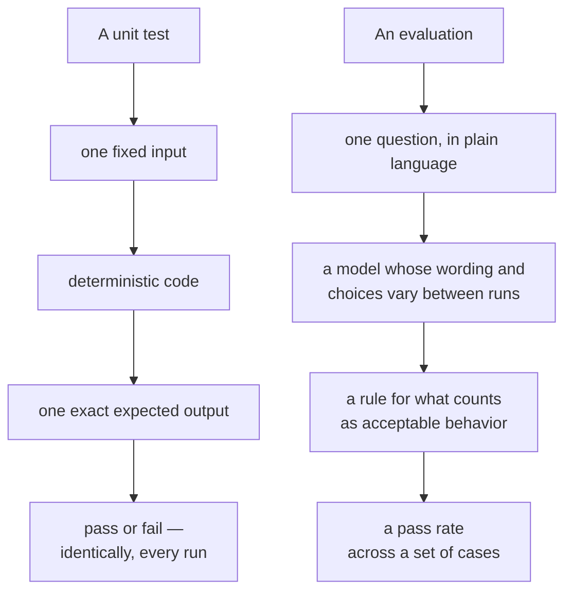
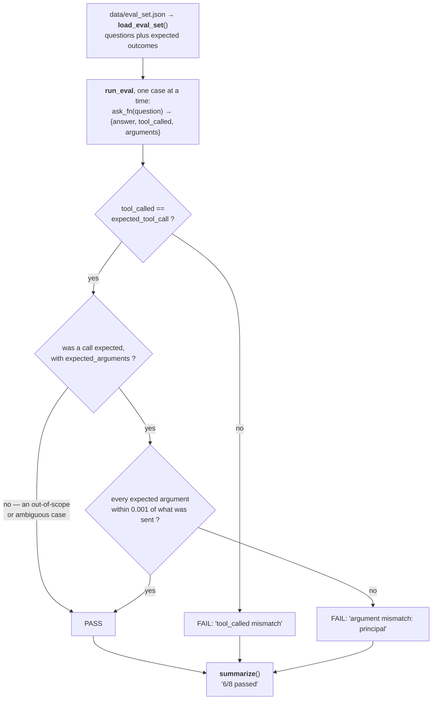

# Chapter 12 — Evaluation

## 12.1 Why This Chapter Exists

Chapter 11 ended with an informal comparison — run a question through both models, read the two answers, form an impression. That's a reasonable first look, but "it seemed to work when I tried it" isn't evidence, it's an anecdote. This chapter builds a small, repeatable eval set and a way to score both models against it, so the local-vs-hosted comparison from Chapter 11.7 becomes something you can actually point to.

## 12.2 Evaluation Is Not Testing

### 12.2.1 What Unit Tests Check

Every test since Chapter 5 has checked the same kind of thing: given this exact input, does the code produce this exact, deterministic output? `calculate_payment(200_000, 0.06, 30, 12)` either returns `1199.10` or it doesn't — there's no ambiguity in what "pass" means.

### 12.2.2 Why a Model Needs Something Different

A language model's behavior isn't deterministic in that same sense — ask it the same question twice and you may get differently worded answers, or even a different decision about whether to call the tool at all. "Pass or fail" still applies, but what counts as passing has to be defined more carefully than "matches this exact string."

> **Process concept: evaluation as its own discipline, distinct from unit testing.** This is the chapter's central distinction, worth stating plainly before writing any eval code: a unit test checks that *code* does what it's supposed to, exactly, every time. An evaluation checks that a *model's behavior*, which varies, stays within acceptable bounds often enough to trust. Both matter. They are not the same tool, and conflating them — expecting eval-style tolerance from a unit test, or unit-test-style exactness from an eval — leads to the wrong kind of disappointment in both.



<!-- DIAGRAM BUILD NOTE: render this mermaid block to an image (e.g. via mermaid-cli) for the print/PDF build -- most PDF pipelines won't render mermaid syntax directly. -->

Same shape, three substituted parts — and the substitution in the middle is what forces the other two. Because the thing being checked doesn't repeat itself exactly, the expected value has to become a rule rather than a literal, and a single result has to become a rate. Ask a unit test to tolerate that variation and it stops catching regressions; ask an eval for exactness and every run looks like a failure.


## 12.3 What to Evaluate

### 12.3.1 Tool-Call Correctness

Did the model call the tool at all, when it should have? And when it did, were the arguments correct — not just present, but matching what the question actually asked for?

### 12.3.2 Answer Quality

Given a correct tool result, did the model report it accurately in plain language? A model that calls the tool correctly but then misreads or mangles the result in its final answer has failed just as thoroughly as one that never called the tool. Flagged here, but not scored automatically by this chapter's harness (12.5.2): judging whether a sentence of prose accurately reports a number is a harder problem than comparing two numbers, needing either a human reader or another model as a judge. This project's `score_case` stays intentionally narrower — tool-call correctness and refusal behavior only — and leaves answer quality to a manual read of the transcripts, the same spot-check 11.7 already had you do.

### 12.3.3 Refusal and Clarification Behavior

Not every question should trigger a tool call. A question outside SPEC.md's scope (Chapter 2.3.4 and 4.7.4's "Out of scope" section: variable-rate mortgages, refinancing, multiple currencies) should be recognized as such, not forced through the calculator anyway. A question that's *in* scope but missing information — "how much would I pay each month?" with no principal, rate, or term given — should prompt for what's missing, not invent plausible-sounding numbers and call the tool with them.

## 12.4 Building a Small Eval Set

### 12.4.1 Representative Questions

A full eval set for this project should run 15–25 questions deep; the set below shows a representative slice of that range — enough to demonstrate every category from 12.3, and a real starting point to extend on your own.

### 12.4.2 Expected Outcomes, Defined Per Case

For each question: should the tool be called, and if so, with which arguments? Store this as data, in `data/eval_set.json`:

```json
[
  {
    "id": "basic-1",
    "question": "What would my monthly payment be on a $200,000 loan at 6% interest over 30 years?",
    "expected_tool_call": true,
    "expected_arguments": {
      "principal": 200000,
      "annual_rate": 0.06,
      "term_years": 30,
      "payments_per_year": 12
    }
  },
  {
    "id": "zero-interest-1",
    "question": "If I borrow $12,000 interest-free and pay it back monthly over a year, what's my payment?",
    "expected_tool_call": true,
    "expected_arguments": {
      "principal": 12000,
      "annual_rate": 0.0,
      "term_years": 1,
      "payments_per_year": 12
    }
  },
  {
    "id": "single-payment-1",
    "question": "I want to pay off a $10,000 loan at 6% in one single payment a year from now. How much would that be?",
    "expected_tool_call": true,
    "expected_arguments": {
      "principal": 10000,
      "annual_rate": 0.06,
      "term_years": 1,
      "payments_per_year": 1
    }
  },
  {
    "id": "frequency-1",
    "question": "Same $200,000 loan at 6% for 30 years, but if I paid biweekly instead of monthly, what would each payment be?",
    "expected_tool_call": true,
    "expected_arguments": {
      "principal": 200000,
      "annual_rate": 0.06,
      "term_years": 30,
      "payments_per_year": 26
    }
  },
  {
    "id": "missing-frequency-1",
    "question": "What's the payment on a $150,000 loan at 5% over 15 years?",
    "expected_tool_call": true,
    "expected_arguments": {
      "principal": 150000,
      "annual_rate": 0.05,
      "term_years": 15,
      "payments_per_year": 12
    }
  },
  {
    "id": "out-of-scope-1",
    "question": "What's the weather like today?",
    "expected_tool_call": false
  },
  {
    "id": "out-of-scope-2",
    "question": "Can you help me figure out if refinancing my mortgage makes sense?",
    "expected_tool_call": false
  },
  {
    "id": "ambiguous-1",
    "question": "How much would I pay each month?",
    "expected_tool_call": false
  }
]
```

Note `missing-frequency-1` and `out-of-scope-2` in particular: the first checks that the model correctly defaults to monthly payments when frequency isn't mentioned (matching `MortgageInput`'s own default from Chapter 7.5.1); the second checks that a question about refinancing — explicitly out of scope since Chapter 2.3.4 — doesn't get forced through the calculator anyway.

### 12.4.3 Data, Not a Hardcoded Script

Storing this as JSON rather than as Python code inside the eval runner means it can be inspected, extended, and reasoned about independently of the code that runs it — the same argument Chapter 8.5.1 made for JSON output over printed text, applied here to test data instead of program output.

## 12.5 Running the Eval

### 12.5.1 A Small Refactor First

Chapter 11's `ask_local` and `ask_hosted` return only a final text answer — not enough for scoring, which needs to know *whether* the tool was called and *with what arguments*. Rather than bolting that onto the existing functions, split each into a detailed version that returns everything, with the original kept as a thin wrapper:

```python
# in llm.py, replacing the body of ask_local:

def ask_local_detailed(question: str) -> dict:
    # Same tool shape as Chapter 11.4.2 — one entry, wrapping
    # get_tool_definition()'s name/description/parameters.
    tool_def = get_tool_definition()
    tools = [
        {
            "type": "function",
            "function": {
                "name": tool_def["name"],
                "description": tool_def["description"],
                "parameters": tool_def["parameters"],
            },
        }
    ]

    first = ollama.chat(
        model=LOCAL_MODEL,
        messages=[{"role": "user", "content": question}],
        tools=tools,
    )
    message = first["message"]
    tool_calls = message.get("tool_calls")

    if not tool_calls:
        return {
            "answer": message["content"],
            "tool_called": False,
            "arguments": None,
        }

    # Only the first call matters — still one tool, same as 11.4.2.
    call = tool_calls[0]
    arguments = call["function"]["arguments"]
    result = call_tool(arguments)

    second = ollama.chat(
        model=LOCAL_MODEL,
        messages=[
            {"role": "user", "content": question},
            message,
            {"role": "tool", "content": str(result)},
        ],
    )
    # arguments is returned here too now — the whole reason for this
    # refactor, since scoring needs to see what the model actually sent,
    # not just the final answer.
    return {
        "answer": second["message"]["content"],
        "tool_called": True,
        "arguments": arguments,
    }


def ask_local(question: str) -> str:
    return ask_local_detailed(question)["answer"]
```

The same restructuring applies to `ask_hosted`, written out in full since the hosted client's shape differs enough from Ollama's to be worth seeing rather than assuming:

```python
# in llm.py, replacing the body of ask_hosted:

def ask_hosted_detailed(question: str) -> dict:
    tool_def = get_tool_definition()
    tools = [
        {
            "type": "function",
            "function": {
                "name": tool_def["name"],
                "description": tool_def["description"],
                "parameters": tool_def["parameters"],
            },
        }
    ]

    first = _client.chat.completions.create(
        model=HOSTED_MODEL,
        messages=[{"role": "user", "content": question}],
        tools=tools,
    )
    message = first.choices[0].message

    if not message.tool_calls:
        return {
            "answer": message.content,
            "tool_called": False,
            "arguments": None,
        }

    # Same two differences from the local path as 11.6.4 noted: a
    # tool_call_id to thread through, and arguments arriving as a JSON
    # string rather than a dict.
    call = message.tool_calls[0]
    arguments = json.loads(call.function.arguments)
    result = call_tool(arguments)

    second = _client.chat.completions.create(
        model=HOSTED_MODEL,
        messages=[
            {"role": "user", "content": question},
            message,
            {
                "role": "tool",
                "tool_call_id": call.id,
                "content": json.dumps(result),
            },
        ],
    )
    return {
        "answer": second.choices[0].message.content,
        "tool_called": True,
        "arguments": arguments,
    }


def ask_hosted(question: str) -> str:
    return ask_hosted_detailed(question)["answer"]
```

This is a small, real example of what Chapter 6.8's "refactor" step looks like several chapters later: existing behavior preserved exactly (both wrappers' signatures and return types are unchanged from Chapter 11), with new capability added underneath.

### 12.5.2 Scoring

In `src/mortgage_calculator_book/eval.py`:

```python
import json
from pathlib import Path
from typing import Any, Callable

# From eval.py's own location (src/mortgage_calculator_book/), climb three
# levels to the project root, then into data/ -- the same file every eval
# question comes from.
EVAL_SET_PATH = (
    Path(__file__).resolve().parent.parent.parent
    / "data" / "eval_set.json"
)


def load_eval_set() -> list[dict[str, Any]]:
    return json.loads(EVAL_SET_PATH.read_text())


def score_case(
    case: dict[str, Any], ask_fn: Callable[[str], dict]
) -> dict[str, Any]:
    # ask_fn is ask_local_detailed or ask_hosted_detailed (12.5.1) --
    # whichever model this run is scoring.
    result = ask_fn(case["question"])

    # First check: did the model call the tool when it should have (or
    # correctly not call it, for an out-of-scope question)? Wrong either
    # way is an automatic fail -- no need to look at arguments at all.
    if result["tool_called"] != case["expected_tool_call"]:
        return {
            "id": case["id"],
            "passed": False,
            "reason": "tool_called mismatch",
        }

    # Second check, only when a call was actually expected: does each
    # argument this case cares about match what the model actually sent?
    # Comparing as floats with a small tolerance avoids false failures
    # from harmless formatting differences like "12" vs "12.0".
    if case["expected_tool_call"] and "expected_arguments" in case:
        for key, expected in case["expected_arguments"].items():
            # arguments is None when no call happened; "or {}" keeps
            # .get() from raising in that case instead of masking it.
            actual = (result["arguments"] or {}).get(key)
            if (
                actual is None
                or abs(float(actual) - float(expected)) > 0.001
            ):
                return {
                    "id": case["id"],
                    "passed": False,
                    "reason": f"argument mismatch: {key}",
                }

    return {"id": case["id"], "passed": True, "reason": None}


def run_eval(
    ask_fn: Callable[[str], dict], verbose: bool = True
) -> list[dict[str, Any]]:
    # One case at a time, not a list comprehension, so progress can be
    # reported as each one finishes -- worth having, given how long a
    # real run over real models actually takes (12.6.1).
    cases = load_eval_set()
    results = []
    for i, case in enumerate(cases, start=1):
        result = score_case(case, ask_fn)
        if verbose:
            status = "PASS" if result["passed"] else "FAIL"
            print(f"[{i}/{len(cases)}] {case['id']}: {status}")
        results.append(result)
    return results


def summarize(results: list[dict[str, Any]]) -> str:
    passed = sum(1 for r in results if r["passed"])
    return f"{passed}/{len(results)} passed"
```

`score_case` is the piece worth tracing carefully, because it checks two different things in a fixed order and gives up at the first one that fails:



<!-- DIAGRAM BUILD NOTE: render this mermaid block to an image (e.g. via mermaid-cli) for the print/PDF build -- most PDF pipelines won't render mermaid syntax directly. -->

The early exit at the first check is deliberate, not an optimization: if the model didn't call the tool when it should have, there are no arguments to compare, and a failure reason of "tool_called mismatch" is a more useful thing to read in the output than a cascade of missing-argument complaints. The middle branch is where `out-of-scope-1` and `ambiguous-1` pass — those cases expect *no* call, so correctly declining is the whole test.

Deliberately simple pass/fail scoring — no partial credit, no weighting. At this scale, that's a feature, not a limitation: results stay easy to read and easy to reason about.

Worth noticing that `run_eval` prints, unlike `calculate_payment` back in Chapter 6.2 — not a contradiction of that chapter's purity rule, just a different kind of function. `calculate_payment` is the domain core, meant to be composed into a CLI, a UI, and a tool interface without dragging any of them along; `run_eval` already isn't that pure, since `ask_fn` itself does real network I/O every time it's called. Given that, reporting progress on an operation that can take minutes is a reasonable, honest thing for this specific function to do — set `verbose=False` if you want the old silent behavior back.

### 12.5.3 Testing the Scoring Logic Itself

The scoring function is plain code, and plain code gets tested the normal way — no model required:

```python
# tests/test_eval.py
from mortgage_calculator_book.eval import score_case


def _fake_ask_correct(question: str) -> dict:
    return {
        "answer": "It would be $1,199.10.",
        "tool_called": True,
        "arguments": {
            "principal": 200000,
            "annual_rate": 0.06,
            "term_years": 30,
            "payments_per_year": 12,
        },
    }


def _fake_ask_no_call(question: str) -> dict:
    return {
        "answer": "I'm not sure.",
        "tool_called": False,
        "arguments": None,
    }


def test_score_case_passes_on_matching_call():
    case = {
        "id": "basic-1",
        "question": "irrelevant here",
        "expected_tool_call": True,
        "expected_arguments": {
            "principal": 200000, "annual_rate": 0.06, "term_years": 30
        },
    }
    assert score_case(case, _fake_ask_correct)["passed"] is True


def test_score_case_fails_when_tool_not_called_but_expected():
    case = {
        "id": "basic-1",
        "question": "irrelevant here",
        "expected_tool_call": True,
    }
    assert score_case(case, _fake_ask_no_call)["passed"] is False
```

## 12.6 Comparing Local vs. Hosted, Formally

### 12.6.1 Running the Full Set Against Both

Both pieces of this section belong in the same file, since the second depends on variables the first defines:

```bash
vi scratch_eval_compare.py
```

```python
from mortgage_calculator_book.eval import (
    load_eval_set,
    run_eval,
    summarize,
)
from mortgage_calculator_book.llm import (
    ask_local_detailed,
    ask_hosted_detailed,
)

local_results = run_eval(ask_local_detailed)
hosted_results = run_eval(ask_hosted_detailed)

print("Local: ", summarize(local_results))
print("Hosted:", summarize(hosted_results))
```

Run it:

```bash
uv run python scratch_eval_compare.py
```

This takes noticeably longer than anything else you've run so far — eight real questions, against two real models, not the mocked responses from 11.8.1's tests. `run_eval`'s progress lines (12.5.2) print as each case finishes, so you'll see `[1/8] basic-1: PASS`-style output scrolling by before the two summary lines at the end. Expect something like `Local: 6/8 passed` and `Hosted: 8/8 passed`; your actual numbers will differ, and that's fine — the point is having real numbers at all, not matching these ones.

### 12.6.2 Reading the Results Side by Side

Print each case's individual result, not just the summary, and look specifically at *where* the two diverge. Add this to the bottom of the same file:

```bash
vi scratch_eval_compare.py
```

```python
for local, hosted in zip(local_results, hosted_results):
    if local["passed"] != hosted["passed"]:
        print(
            f"{local['id']}: local={local['passed']} "
            f"hosted={hosted['passed']}"
        )
```

Run the same command again:

```bash
uv run python scratch_eval_compare.py
```

A case where local fails and hosted passes is informative in a way an aggregate score alone isn't — it might mean local reliably struggles with, say, the `ambiguous-1` case specifically (calling the tool with guessed numbers rather than declining), which tells you something concrete and actionable about that model's behavior, not just "hosted scored higher." Delete the scratch file once you've read through the output:

```bash
rm scratch_eval_compare.py
```

### 12.6.3 From Impression to Evidence

This is Chapter 11.7's informal comparison, done properly: instead of "the hosted model seemed to answer better," you now have a specific pass count, on a specific, inspectable set of questions, with specific cases identified where the two diverge. That's a claim you can actually defend, and re-check later.

## 12.7 Regression Checks

### 12.7.1 Why Re-Run This Later

Any future change to the tool's description (Chapter 10.4.1), its schema, the model chosen, or even the prompt structure in `llm.py` can shift how reliably the model calls the tool — sometimes for the better, sometimes not. Re-running the eval set after any such change is how you'd actually notice a regression, rather than assuming a change was harmless because it seemed reasonable at the time.

### 12.7.2 A Lightweight Habit

This doesn't need full continuous-integration infrastructure (Appendix A.3 covers that, if you want it later) — just the habit of running `run_eval` again after a meaningful change and comparing the new summary to the last one you recorded. Simple, and enough for a project this size.

## 12.8 Checkpoint

Before moving to Chapter 13, this should all be true:

- [ ] `data/eval_set.json` contains at least the eight representative cases above, covering correct calls, edge cases, out-of-scope questions, and an ambiguous question
- [ ] `ask_local_detailed` and `ask_hosted_detailed` exist, with `ask_local` and `ask_hosted` preserved as thin wrappers around them
- [ ] `run_eval` and `score_case` work correctly, verified with mocked `ask_fn` functions in `tests/test_eval.py`
- [ ] You've run the full eval set against both the local and hosted model at least once, and can state both pass counts
- [ ] You've identified at least one case where the two models diverge, and have a plausible explanation why

**What's next:** Chapter 13 hardens the whole system against the messier reality outside this curated eval set — malformed input, unexpected model behavior, and everything else a real user might do that these eight questions don't cover.
