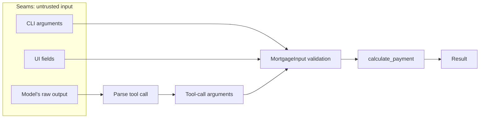
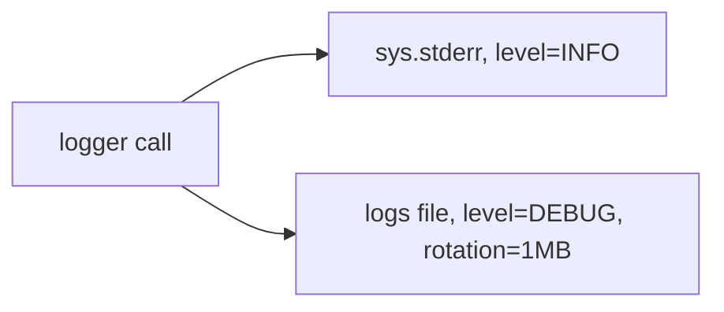
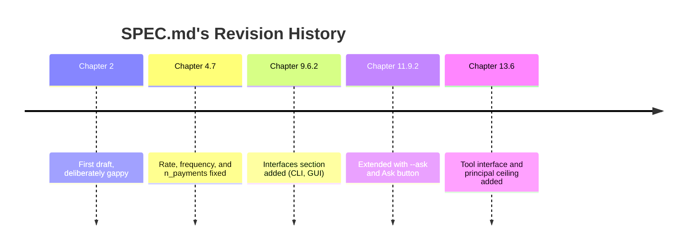

# Chapter 13 — Hardening

## 13.1 Why This Chapter Exists

Chapter 12 proved the system works against a curated set of questions you wrote yourself. This chapter assumes a less forgiving user — one who fat-fingers a number, whose model produces a malformed tool call, or who asks something the eval set never anticipated. By the end, every seam this project has will handle failure gracefully instead of crashing, structured logging will exist to help you diagnose problems after the fact, and SPEC.md and README.md will each get one last honest check against what actually got built.

## 13.2 What "Production-ish" Means for a Learning Project

### 13.2.1 Setting Scope Honestly

This chapter does not turn the mortgage calculator into a production system — that would mean deployment infrastructure, monitoring, authentication, and considerably more than a book chapter can responsibly cover. What it does mean: the system should survive contact with a careless or curious user without crashing, losing data, or producing a silently wrong answer.

### 13.2.2 What's Still Out of Scope

Docker, CI/CD, and the rest of Appendix A remain out of scope here too — hardening in this chapter is about the application's own behavior at its boundaries, not about how it's deployed or automated.

## 13.3 Finding the Seams

### 13.3.1 Mapping the Boundaries

Four places in this system currently receive input from something outside your own tested code: the CLI (Chapter 8), the UI (Chapter 9), tool-call arguments arriving from a model (Chapter 10–11), and the model's own raw output (Chapter 11). Each is a **seam** — a place where this project's trusted, tested code meets something less predictable.



<!-- DIAGRAM BUILD NOTE: render this mermaid block to an image (e.g. via mermaid-cli) for the print/PDF build -- most PDF pipelines won't render mermaid syntax directly. -->

CLI and UI arguments converge directly on the same validation boundary — `MortgageInput` doesn't care which front end an input came from. The model's path is different: its raw output has to be parsed before tool-call arguments even exist, and that one parsing step has two distinct ways to go wrong — malformed JSON (13.4.2) or no tool call at all (13.4.3) — before whatever survives parsing reaches that same boundary too.

### 13.3.2 Why Each Needs Different Handling

A bad float typed into the UI (Chapter 9) is already caught by `MortgageInput`'s validation — that seam is largely handled. A model producing malformed JSON where valid tool arguments were expected (Chapter 11) is a genuinely different failure, at a different layer, and nothing built so far specifically guards against it. Treating every seam as if it needed the same fix would miss what's actually still exposed.

## 13.4 Error Handling at Each Seam

### 13.4.1 Stress-Testing Existing Validation

Chapter 7's `MortgageInput` already rejects negative or zero principal, out-of-range rates, and non-positive terms. What it doesn't yet catch: a principal so large it's obviously a data-entry mistake rather than a real loan. Add one more constraint:

```python
# in validation.py

    @field_validator("principal")
    @classmethod
    def principal_must_be_positive(cls, v: float) -> float:
        if v <= 0:
            raise ValueError("principal must be positive")
        if v > 100_000_000:
            raise ValueError("principal must be less than $100,000,000")
        return v
```

And a test:

```python
def test_absurdly_large_principal_rejected():
    with pytest.raises(ValidationError):
        MortgageInput(principal=1e12, annual_rate=0.06, term_years=30)
```

This is a genuinely new constraint, not previously written down anywhere — worth remembering for section 13.6, where SPEC.md gets checked against exactly this kind of drift.

### 13.4.2 Malformed Tool-Call Arguments

Chapter 10's `call_tool` already handles the case where arguments are present but fail `MortgageInput`'s validation. It does *not* handle a case one layer earlier: in `ask_hosted_detailed`, `call.function.arguments` arrives as a raw JSON string that has to be parsed before it even reaches `call_tool` — and a model can, occasionally, produce malformed JSON there. Harden that specific step:

```python
# in llm.py, inside ask_hosted_detailed

    call = message.tool_calls[0]
    try:
        arguments = json.loads(call.function.arguments)
    except json.JSONDecodeError:
        return {
            "answer": (
                "I had trouble understanding those loan "
                "details — could you restate them?"
            ),
            "tool_called": True,
            "arguments": None,
        }

    result = call_tool(arguments)
```

This is a different failure from the one Chapter 10.5.1 already guards against: that chapter handles *valid* JSON with *invalid* values (a negative principal); this handles JSON that isn't valid JSON at all. Both are real, and they needed separate handling because they happen at separate points in the pipeline.

### 13.4.3 Unexpected Model Output

What if the model returns neither a tool call nor any content — an empty response? `ask_local_detailed` and `ask_hosted_detailed` should return something sensible rather than `None` or an empty string reaching a user unexplained:

```python
    if not tool_calls:
        fallback = "I wasn't able to generate a response — try rephrasing."
        return {
            "answer": message.get("content") or fallback,
            "tool_called": False,
            "arguments": None,
        }
```

### 13.4.4 Agent-Assisted, Tests First

For each seam above, the pattern is the same one this book has used throughout: write a failing test describing the bad input and the expected graceful behavior, then let Pi propose the handling, then review. 13.4.1 through 13.4.3 showed you the handling directly; here's the test half, for 13.4.2's malformed-JSON case specifically:

```bash
pi "Add a test to tests/test_llm.py confirming \
    ask_hosted_detailed handles malformed \
    tool-call-argument JSON without raising, using a \
    mocked client response."
```

A correct response looks like this:

```python
from unittest.mock import MagicMock

from mortgage_calculator_book.llm import ask_hosted_detailed


def test_ask_hosted_detailed_handles_malformed_json(monkeypatch):
    tool_call = MagicMock()
    tool_call.function.arguments = "{not valid json"
    message = MagicMock(tool_calls=[tool_call])
    first_response = MagicMock()
    first_response.choices = [MagicMock(message=message)]

    mock_create = MagicMock(return_value=first_response)
    monkeypatch.setattr(
        "mortgage_calculator_book.llm._client.chat.completions.create",
        mock_create,
    )

    result = ask_hosted_detailed("some question")

    assert result["tool_called"] is True
    assert result["arguments"] is None
    assert "trouble understanding" in result["answer"]
    assert mock_create.call_count == 1
```

Review it against two things specifically, not just "does it pass." First: this doesn't look like Chapter 11.8.1's mocked test, and it shouldn't — that one mocked `ollama.chat`, which returns plain dictionaries, so its fixtures were dict literals. This mocks OpenAI's client, which returns objects with attributes (`response.choices[0].message.tool_calls[0].function.arguments`), so the fixture has to match — `MagicMock()` objects with attributes set, not dicts. A proposal that hands `call_tool` a dict here would fail for a reason that has nothing to do with whether the actual error handling works.

Second: `mock_create.call_count == 1`, not 2. Look back at 13.4.2's code — the `except json.JSONDecodeError` branch returns immediately, before the second `_client.chat.completions.create` call that would normally send a result back to the model. A test asserting `call_count == 2` would be testing for behavior the code was never supposed to have; if Pi's version does that, it's wrong even though the rest might look reasonable.

## 13.5 Structured Logging with loguru

### 13.5.1 Why Logging, Not Just print

By this point in the book, you've almost certainly reached for a `print()` statement at least once to see what a value was mid-debugging (perhaps back in Chapter 5.7's pdb section, or since). That's fine for a single debugging session — it's a poor substitute for a permanent, structured record of what a running system actually did, especially once something goes wrong somewhere you weren't watching.

### 13.5.2 Installing loguru

```bash
uv add loguru
```

loguru over the standard library's `logging` module specifically because it needs meaningfully less configuration to get something genuinely useful — one call to set up sensible output, rather than the standard library's handler/formatter/logger hierarchy, which is more powerful but considerably more ceremony for a project this size.

In `src/mortgage_calculator_book/logging_config.py`:

```python
import sys

from loguru import logger


def setup_logging() -> None:
    logger.remove()
    logger.add(sys.stderr, level="INFO")
    logger.add(
        "logs/mortgage_calculator_book.log", rotation="1 MB", level="DEBUG"
    )
```



<!-- DIAGRAM BUILD NOTE: render this mermaid block to an image (e.g. via mermaid-cli) for the print/PDF build -- most PDF pipelines won't render mermaid syntax directly. -->

One call, two destinations, two different filters: everything INFO and above also goes to your terminal as it happens; everything DEBUG and above, which is everything, goes to the file, capped at 1MB per file before rotating. That's why 13.5.4's log-reading exercise finds a warning in the file that a casual glance at the terminal might have scrolled past.

This is a function, not module-level code that runs on import, deliberately — a bare `import logging_config` for its side effects alone is exactly the kind of thing `ruff check` flags as an unused import (Chapter 3's `F` rules), and fighting your own linter every time you touch this file isn't worth it. Call it explicitly, once, at the top of `main()` in both `cli.py`:

```python
# in cli.py

from mortgage_calculator_book.logging_config import setup_logging


def main(argv: list[str] | None = None) -> int:
    setup_logging()
    parser = build_parser()
    args = parser.parse_args(argv)
    ...
```

and `ui.py`:

```python
# in ui.py

from mortgage_calculator_book.logging_config import setup_logging


def main() -> None:
    setup_logging()
    app = QApplication(sys.argv)
    window = MortgageCalculatorWindow()
    window.show()
    sys.exit(app.exec_())
```

Either front end now configures logging the same way, the moment it starts — one line added near the top of each `main()`, nothing else in either file changes.

### 13.5.3 Logging at the Seams

Add log calls at each of the seams from 13.4 — starting with the CLI itself, 13.4.1's seam. Right now `main()` only ever prints; nothing in this path calls `logger.*()` at all, which means 13.5.4's exercise below would find an empty log file without this:

```python
# in cli.py

from loguru import logger

    try:
        data = MortgageInput(
            principal=args.principal,
            annual_rate=args.annual_rate,
            term_years=args.term_years,
            payments_per_year=args.payments_per_year,
        )
    except ValidationError as exc:
        for error in exc.errors():
            logger.warning("CLI input rejected: {}", error["msg"])
            print(f"Error: {error['msg']}", file=sys.stderr)
        return 1

    payment = round(calculate_validated_payment(data), 2)
    logger.info("CLI computed payment: {}", payment)
    if args.format == "json":
        print(json.dumps({"payment": payment}))
    else:
        print(f"Fixed periodic payment: ${payment:,.2f}")
    return 0
```

The `print()` calls stay exactly as they were — that's still what a person running the CLI actually sees. `logger.*()` is a second, parallel record of the same events, for exactly the situation 13.5.4 describes: reading back what happened after the fact, not watching it happen live.

Next, the seam from 13.4.2, since `loguru` wasn't available yet when that code was first written:

```python
# in llm.py, inside ask_hosted_detailed

from loguru import logger

    call = message.tool_calls[0]
    try:
        arguments = json.loads(call.function.arguments)
    except json.JSONDecodeError:
        logger.warning(
            "Malformed tool-call JSON from model: {}",
            call.function.arguments,
        )
        return {
            "answer": (
                "I had trouble understanding those loan "
                "details — could you restate them?"
            ),
            "tool_called": True,
            "arguments": None,
        }

    result = call_tool(arguments)
```

And the seam from Chapter 10.5.1, in `tool.py`:

```python
# in tool.py

from loguru import logger


def call_tool(arguments: dict) -> dict:
    try:
        data = MortgageInput(**arguments)
    except ValidationError as exc:
        logger.warning("Tool call rejected: {} ({})", arguments, exc)
        return {"error": "; ".join(e["msg"] for e in exc.errors())}

    payment = round(calculate_validated_payment(data), 2)
    logger.info("Tool call succeeded: payment={}", payment)
    return {"payment": payment}
```

**What not to log**: never log `OPENROUTER_API_KEY` or any other secret from `config.py`, even at debug level, even temporarily while troubleshooting — a log file is easy to forget about and easy to accidentally share or commit.

### 13.5.4 Reading a Log Back

Deliberately trigger a failure, then read what got recorded:

```bash
mortgage-calculator-book --principal -5000 --annual-rate 0.06 --term-years 30
cat logs/mortgage_calculator_book.log
```

You should see the `WARNING` line from 13.5.3, with the actual rejected arguments and the validation error, timestamped. This is the payoff of this section: a real failure, diagnosed after the fact from a log file alone, the way you'd have to if a user reported a problem you weren't present to watch happen.

## 13.6 Final Spec and README Check

This section closes the loop on both of this project's living documents — SPEC.md first, since it's been through this before, then README.md in 13.6.3, which hasn't.

This is the fourth time in the book SPEC.md has been opened and found wanting — worth seeing the whole pattern at once before adding to it again:



<!-- DIAGRAM BUILD NOTE: render this mermaid block to an image (e.g. via mermaid-cli) for the print/PDF build -- most PDF pipelines won't render mermaid syntax directly. -->

Not five unrelated edits — one document, checked against reality at five different points as the project grew past what it originally described. This is the last of those checks in this book, not because SPEC.md becomes perfect after it, but because the book does.

### 13.6.1 Returning to SPEC.md

Open the version last revised in Chapter 11.9.2. Read it fresh, as if you'd never seen the rest of this project, and ask: does this still describe what actually got built?

### 13.6.2 What's Drifted

Two things stand out. First, section 13.4.1's new principal ceiling is a real constraint that exists in the code now but appears nowhere in the spec. Second: the "Interfaces" section Chapter 9.6.2 started and Chapter 11.9.2 extended lists the CLI, the GUI, and the natural-language additions to both — but not the tool interface those additions actually depend on, from Chapters 10–11. The section describes what a user sees without ever naming the mechanism underneath it.

Reconcile both:

```markdown
## Interfaces
- Command-line interface (human-readable and JSON output; --ask
  for a natural-language question, answered via the tool interface)
- Desktop GUI (see docs/ui.md for the current layout):
  - Inputs: principal, annual rate, term (years), payments per year
  - Actions: Calculate, Clear, and Ask (a natural-language question,
    answered via the tool interface)
  - Invalid input shows an error message in place, not a crash
- Tool interface for language-model use (see tool.py), supporting both
  local and hosted models

## Inputs
- principal: the loan amount, in dollars (0 < principal <= 100,000,000)
- annual_rate: the annual interest rate, as a decimal (e.g. 0.06 for 6%)
- term_years: the length of the loan, in years
- payments_per_year: number of payments per year (default: 12, monthly)
```

Only the last bullet under "Interfaces" is actually new here — everything above it should already be sitting in your file from 9.6.2 and 11.9.2. This shows the whole section so you can confirm what's there against what's shown, not because all of it needs retyping.

Commit the reconciliation on its own:

```bash
git add SPEC.md
git commit -m "Reconcile SPEC.md: add tool interface, \
    document principal ceiling"
git push
```

> **Process concept: closing the loop.** Chapter 2 opened with the idea that a spec is a living document, expected to be wrong in places. Chapter 4 caught and fixed the first round of gaps, once real domain math existed; Chapters 9 and 11 each added more as new interfaces arrived. This is the same check, run one more time, now that the *entire* system exists — and it found exactly the kind of drift this book has been warning about since Chapter 2.2.2: not a mistake, just reality moving faster than the document describing it, caught because someone deliberately went looking.

### 13.6.3 Reconciling README.md

Chapter 8.8 made the same living-document promise for a different reader — that the README would need another pass once Chapter 9 gave the calculator a second way to run. Chapter 9 added the GUI. Chapter 11 added `--ask` on both the CLI and the GUI, and the tool interface underneath both. None of it ever reached `README.md` — the file still describes the project exactly as it stood at the end of Chapter 8: one command, four structured flags, two output formats.

Not everything from 13.6.2 needs a mirror here. The tool interface itself is written for SPEC.md's collaborator audience, not README's end-user one (8.8's own distinction) — it doesn't need a README section of its own. What does: the two user-visible entry points built on top of it, `--ask` and the GUI's Ask button, since those are exactly the kind of thing a new user opening this file would want to know how to run.

Same tool, same discipline as 8.8.4:

```bash
pi "Update README.md for this project. It was last written \
    at the end of Chapter 8 and only documents the CLI's \
    structured flags. Read SPEC.md, docs/ui.md, and \
    src/mortgage_calculator_book/cli.py, and add real usage \
    examples for the GUI and for the --ask flag on both the \
    CLI and GUI, based on what you find there rather than \
    guessing at flag names. Don't rewrite sections that are \
    still accurate — only add what's missing."
```

Review it with the same care 8.8.4 asked for, plus one thing specific to this pass: 8.8.4's "run each example yourself" is harder to satisfy here than it was for the structured flags. A `--ask` example only proves out against a real model, local or hosted — the same standard Chapter 11's own checklist held itself to; reading the text and nodding isn't running it. And a GUI example can't be copy-pasted into a terminal at all — confirming it means actually opening the window and following the steps the README claims will work, not just checking that the prose is plausible. Watch too for Pi carrying SPEC.md's "Tool interface" bullet over into README as its own section — per the distinction above, that's collaborator-facing content this file doesn't need.

A reasonable addition looks like this:

```markdown
## Usage

    uv run mortgage-calculator-book \
        --principal 200000 --annual-rate 0.06 --term-years 30
    # Fixed periodic payment: $1,199.10

    uv run mortgage-calculator-book \
        --principal 200000 --annual-rate 0.06 --term-years 30 --format json
    # {"payment": 1199.1}

    uv run mortgage-calculator-book --ask \
        "What would my payment be on a $200,000 loan at 6% over 30 years?"
    # A plain-language answer containing $1,199.10

## GUI

    uv run python -m mortgage_calculator_book.ui

Fill in the four fields and click Calculate, or type a question
and click Ask — see docs/ui.md for the full layout. Both paths
go through the same validated calculation; neither is a separate
implementation.
```

Commit the reconciliation on its own, same as SPEC.md's:

```bash
git add README.md
git commit -m "Reconcile README.md: document the GUI and the --ask flag"
git push
```

Chapter 8.8's promise is finally kept — four chapters late, and only because someone went back and checked.

## 13.7 The Complete Definition of Done

### 13.7.1 Assembling Every Checkpoint

Every chapter from 0 through 13 ended with its own checklist. Run through the whole system against all of them at once, not just the most recent chapter's:

- [ ] The project is git-tracked, pushed to GitHub, with a clean commit history (Ch. 0)
- [ ] Pi is configured and every agent-proposed change in this project's history was reviewed before being committed (Ch. 1)
- [ ] `SPEC.md` accurately describes the system as it exists today, including all three interfaces and the principal ceiling (Ch. 2, revised Ch. 4, 9, 11, and 13)
- [ ] `README.md` documents both interfaces (CLI and GUI) with real, working examples, including `--ask` and the Ask button, and is committed (Ch. 8, revised Ch. 13)
- [ ] `ruff check .` and `ruff format .` pass cleanly across the whole project (Ch. 3)
- [ ] The Chapter 4.5 worked example ($200,000 / 6% / 30yr → $1,199.10) is verified correct through every front end: CLI, UI, and the tool interface (Ch. 4, 6, 8, 9, 10)
- [ ] The full test suite passes: core, validation, CLI, UI logic, tool, LLM wiring (mocked), and eval scoring (Ch. 5–12)
- [ ] `calculate_payment` remains pure — no I/O, no printing, no external state (Ch. 6)
- [ ] `MortgageInput` is the only path from raw input into the core, for every front end (Ch. 7)
- [ ] `.env` holds real secrets, is git-ignored, and `.env.example` documents what's needed (Ch. 8)
- [ ] The eval set (Ch. 12) has been run against both local and hosted models, with results recorded
- [ ] Every identified seam (13.3) fails gracefully rather than crashing, and is logged (13.4–13.5)

### 13.7.2 What to Do With What Doesn't Pass

This list is meant to surface a few gaps, not to be a formality you skim and check off. If something's missing — an old test that's been silently skipped, a `.env.example` that's drifted out of date, a README that still only documents the CLI, a front end that was never actually re-tested against the Chapter 4.5 example after some later change — fix it now, with the whole system in front of you, rather than leaving it for a reader (including future-you) to discover.

## 13.8 Checkpoint

Before moving to the Closing chapter, this should all be true:

- [ ] Every seam identified in 13.3 has explicit, tested error handling
- [ ] loguru is configured and logging real events at each seam, with no secrets ever logged
- [ ] You've deliberately triggered a failure and diagnosed it from the log file alone
- [ ] `SPEC.md` has been reconciled with the system as it actually exists, including interfaces and the principal ceiling
- [ ] `README.md` has been reconciled with the system as it actually exists, including the GUI and the `--ask` flag
- [ ] The full checklist in 13.7.1 has been run against the whole project, not just this chapter's changes

**What's next:** the Closing chapter looks back across all fourteen chapters — what was hand-written, what was agent-assisted, and why that boundary sat where it did throughout.
