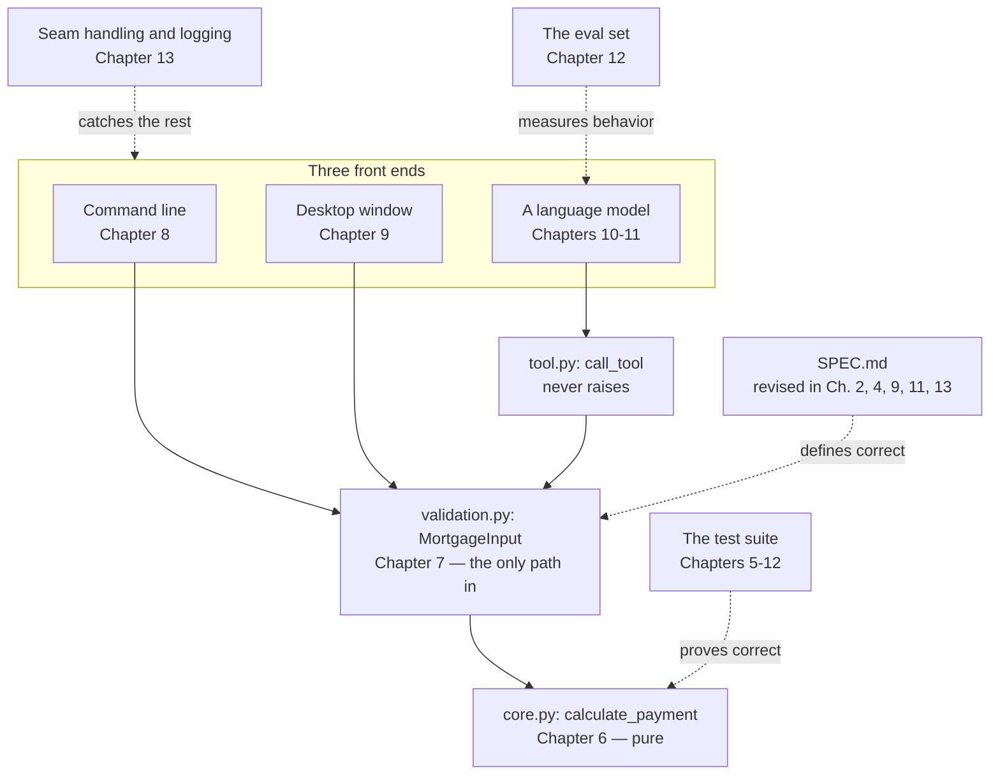
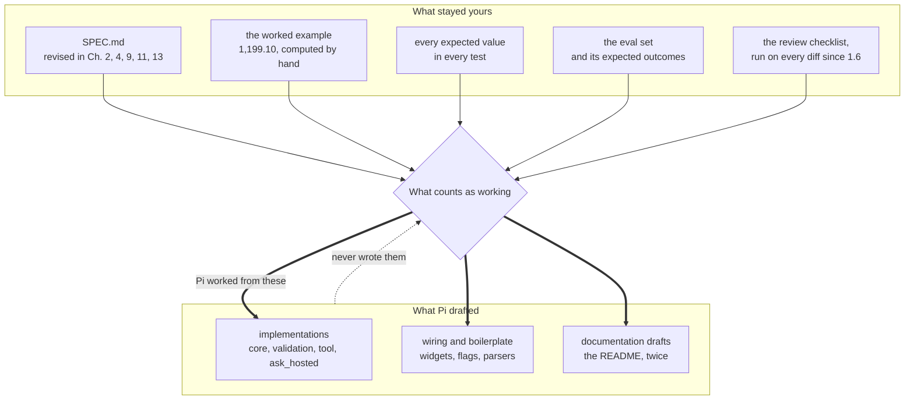

# Closing

## C.1 Why This Chapter Exists

Fourteen chapters is a lot of ground covered one small step at a time. This chapter is a deliberate pause — not a new build step, but a chance to look back at what all those steps actually added up to, before you close the book.

## C.2 What Got Built

Underneath everything — the terminal commands, the Pydantic models, the agent-reviewed diffs — one system exists now: a pure mathematical core (Chapter 6), wrapped in a validation layer that enforces what SPEC.md says is valid (Chapter 7), reachable through three genuinely different front ends that all share that same core without duplicating a line of its logic — a command line (Chapter 8), a graphical window (Chapter 9), and a language model that can operate it on a user's behalf (Chapters 10–11). Around all of that: an evaluation discipline that checks the model-facing layer honestly rather than anecdotally (Chapter 12), and a hardening pass that assumes the world outside your code is messier than your tests ever were (Chapter 13). One core, three front ends, held together by a spec that got checked against reality four times and corrected every time.

That paragraph names eight chapters' worth of components in one breath. Here they are with the wiring visible:

<!-- DIAGRAM BUILD NOTE: render this mermaid block to an image (e.g. via mermaid-cli) for the print/PDF build -- most PDF pipelines won't render mermaid syntax directly. -->

This is the same diagram Chapter 11.9 drew, with Chapters 12 and 13's contributions added around the outside. Nothing in the solid path changed after Chapter 11 — the last two chapters didn't extend the system, they made it honest about how well it works and how it fails. The dotted arrows are the ones the next section is about: every one of them starts at something you wrote.

## C.3 What Was Hand-Written vs. AI-Assisted, Chapter by Chapter

| Chapter | Pi's role | What stayed yours |
|---|---|---|
| 0 — Orientation | None yet | Everything — pure setup |
| 1 — Meet Your Coding Agent | First delegated task (a docstring) | Configuration, review, the habit of reading every diff |
| 2 — Writing SPEC.md | Drafted initial structure | Catching the gaps it papered over (rate vs. periodic rate, unstated frequency) |
| 3 — Holding the Agent to a Standard | Fixed flagged lint issues | Deciding what standard to hold it to |
| 4 — Fixed Mortgages | Optional arithmetic double-check | The entire derivation, the worked example, the spec revision |
| 5 — Tests & TDD | Drafted additional test skeletons | The worked-example test and both edge-case tests, and every expected value |
| 6 — Mathematical Core Library | Implementation draft | The formula translation, the review checklist (rate conversion, off-by-one, float safety) |
| 7 — Validation | Implementation draft | Every boundary condition, sourced directly from SPEC.md |
| 8 — CLI | Wiring implementation | The command shape, the stderr/stdout distinction, the `.env` pattern |
| 9 — Calculator UI | Boilerplate widget wiring | Layout judgment, the decision not to test the GUI directly |
| 10 — Tool Interface | Implementation draft | `TOOL_DESCRIPTION`'s wording — the one piece of this project that's really prompt engineering |
| 11 — LLM Interface | Drafted `ask_hosted` from `ask_local`'s pattern | `ask_local` itself, the two-model distinction, the closest review in the book |
| 12 — Evaluation | None — the eval set is entirely hand-authored | Every eval question and its expected outcome — the actual judgment the whole chapter rests on |
| 13 — Hardening | Proposed handling per seam, drafted the README update | Identifying the seams themselves, the logging policy, the final spec and README reconciliation |

## C.4 Why the Boundary Sat Where It Did

Look at the right-hand column of that table as a whole, rather than row by row, and a pattern emerges: Pi drafted implementations, wiring, and boilerplate — real, useful work — but it never once decided what "correct" meant. That decision stayed encoded in things you wrote yourself: SPEC.md's revisions, the worked example's exact numbers, the eval set's expected outcomes, the review checklists you ran every proposed change against. Pi worked *from* those artifacts. It never got to write them.

That's the front matter's diagram again, with fourteen chapters of real artifacts filled in where the abstractions were:

<!-- DIAGRAM BUILD NOTE: render this mermaid block to an image (e.g. via mermaid-cli) for the print/PDF build -- most PDF pipelines won't render mermaid syntax directly. -->

Every arrow still points the same way it did before Chapter 0. The top row got longer and more specific over fourteen chapters; the direction of the heavy arrows never changed once. That's the whole claim — not that the bottom row is small, but that nothing in it ever moved up.

That's the actual thesis of this book, stated plainly now that there's a whole system to point at rather than an abstract claim in the front matter: a hybrid system isn't defined by how much of the code an agent wrote. It's defined by who — or what — gets to decide what counts as working. Keep that decision yours, and an agent drafting most of your implementation code is a force multiplier. Let that decision drift to the agent, even a little at a time, across enough chapters, and "hybrid" quietly becomes "the agent did it," which was never the point.

That risk doesn't expire when the book does. Every project you build after this one will offer the same quiet trade — accept a plausible-looking output instead of actually understanding it — and the tools available for making that trade easier will only get better, not worse. The habits this book tried to build — reading every diff since Chapter 1.6, writing the test before the implementation since Chapter 5, catching a spec against reality since Chapter 4.7 — are worth keeping specifically because the temptation they're guarding against isn't going away.

## C.5 Where to Apply This Pattern Next

The shape generalizes cleanly: pure core, validation layer, multiple front ends — including one for a model — evaluation, hardening. Nothing about that shape is specific to mortgages. Pick a domain you already understand well enough to write a Chapter 4-style primer for — something you could derive a formula or a rule for by hand, and verify a worked example against, the same way this book verified $1,199.10 before a single line of `core.py` existed. That primer is the real starting point for your next project, more than any of the tooling chapters were.

The Appendix is still there, with Docker, CI/CD, type checking, and the rest, named and briefly described, for whenever a future project actually needs one of them.

## C.6 A Closing Note

This wasn't a book about how impressive an AI coding agent can be — plenty of other places will make that case for you, and reasonable people are still working out how much of it holds up. It was a book about a narrower, more durable claim: the discipline this book asked you to practice — a written spec, tests before implementation, a habit of reading every diff, an honest eval instead of an anecdote — is what made the agent genuinely useful here, not the other way around. Keep the discipline. The tools will keep changing.
